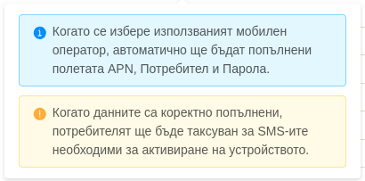
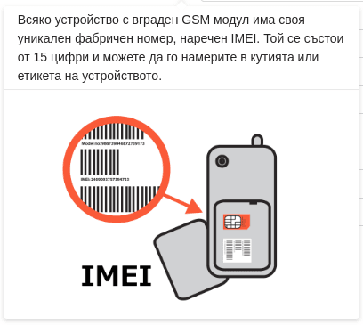

# Въведение

В този раздел е описан процесът по активиране на проследяващо устройство в системата Fleerp.

- Автоматично или ръчно
- Проследяващи устройства
- Мобилно приложение

# Автоматично или Ръчно

Тази секция описва двата основни метода за активиране на проследяващо устройство (автоматичен / ръчен),
както и техните предимства и недостатъци.

### Автоматично активиране

Автоматичното активиране на устройсвто е функционалност, която елиминира нуждата от
предварителни настройки чрез USB кабел или сложни SMS-и. По този начин процесът на активация е
значително опростен, а разходите за инсталацията се намалят значително.

Основните параметри, които трябва да бъдат конфигурирани за първоначална GPRS връзка, се изпращат автоматично
чрез SMS от сървъра към устройството.

- APN настройки за избрания GSM оператор
- Адрес и порт на сървъра

При активация на ново устройство, потребителят е задължен да въведе телефонния номер на SIM картата,
която се намира в него. След като приключи, към устройството ще бъдат изпратени няколко конфигурационни SMS-а.
Важно уточнение, което трябва да се направи е, че тракерът трябва да е включен за да може да получи тези съобщения. 

### Ръчно активиране

Ако по някаква причина командите за автоматично активиране, които са изпратени като SMS съобщения, не са получени от устойството,
то трябва да се пристъпи към ръчно активиране. Причините са многобройни, като най-честата е свързана с
антиспам защита, която налага ограничене върху името на потребителя или дължината на съобщението.
Също така могат да се появят и технически проблеми, поради използването на символи като $, #, %.

Основните параметри, които трябва да се конфигурират ръчно:

- APN настройки за избрания GSM оператор
- Адрес и порт на сървъра

# Проследяващи устройства

Активирането на GPS проследяващо устройство е основополагащо за използването на системата Fleerp.  
Тази секция дава подробна информация, как това може да се осъществи в няколко лесни стъпки.

След като потребителят е влязъл в системата, има две възможности за активиране на устройство:

- да кликне върху иконата за активиране на устройството - която се намира в главната лента; 
- да достъпи **настройки/наблюдавани обекти** и да кликне бутон "Нова активация";

### Първа стъпка
Първата стъпка дава възможност да се избере между активиране на GPS проследяващо устройство или мобилно устройство.
За активиране на GPS проследяващо устройство, трябва да се избере "Разширени настройки" и след това бутон "Напред".

 

---

### Втора стъпка
Във втората стъпка, потребителят трябва да въведе:

- телефонен номер на SIM картата, която се намира в GPS проследяващото устройство;
- *Мобилен оператор* - при избиране на мобилен оператор, автоматично ще бъдат попълнени следващите полета:
  - *APN, Потребител и Парола* - които могат да бъдат видяни на официалната страница на мобилния оператор;

#### Важно:
Полетата APN, Потребител и Парола, трябва да са въведени за да се извърши автоматична активация на проследяващо устройство,
в противен случай е нобходимо ръчно активиране на устройството.

За полето "Мобилен оператор" има допълнителна информация за улеснение на потребителя,
която е достъпна от бутона '?'.

---

### Трета стъпка
В третата стъпка е необходимо да се попълнят всички полета: *ID, Етикет, Производител, Модел, Категория*.
След като данните са попълнени коректно, трябва да се кликне бутон "Активирай".

За полето ID има допълнителна информация за улеснение на потребителя,
която е достъпна от бутона '?'.

Могат да се активират всички GPS проследяващи устройства, изброени в списъка с поддържани модели.
Ако даден модел не бъде намерен, моля свържете се с нас.
