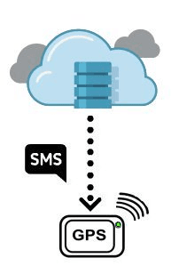
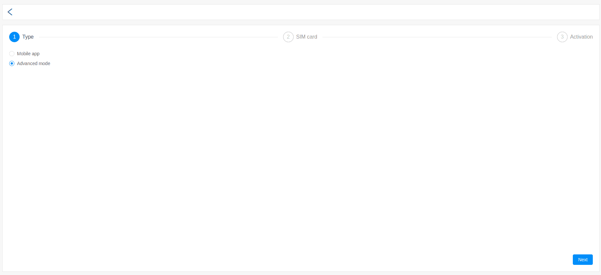
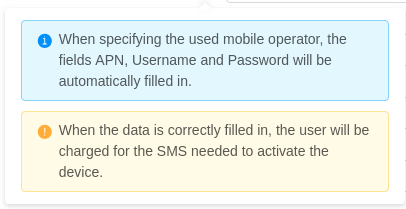

# Introduction

This section describes the process of activating a tracking device in the Fleerp system.

- Auto vs Manual
- Tracking devices
- Mobile app

# Auto vs Manual

This section describes the two main methods for activation of tracking device (auto/manual),
as well as their advantages and disadvantages.

### Auto setup

Auto device activation is a feature that eliminates the need for
presets via USB cables or complex SMS. In this way, the activation process is
significantly simplified, and the cost of the installation is reduced.

The basic parameters to be configured for an initial GPRS connection are automatically sent
via SMS from the server to the device.

- APN settings for the chosen GSM network provider
- Server address and port

When activating a new device, the user is required to enter the number of the SIM card, which is placed within it.
Up on finish, several configuration SMS will be sent to the device.
An important clarification that needs to be done is that the tracker should be switched on to receive these messages.

### Manual setup

For any reason the auto activation commands sent as SMS messages are not received by the device,
it must be manually activated. The reasons are numerous, the most common one being
antispam protection that restricts the name of the user or the length of the message.
Technical problems may also occur due to the use of symbols like $, #, %.
 
The basic parameters, which should be set up manually:

- APN settings for the chosen GSM network provider
- Server address and port

# Tracking devices

Activating a GPS tracking device is fundamental for using the Fleerp system.
This section provides detailed information on how this can be done in few easy steps.

Once the user has logged in, there are two ways to activate a device:

- click on the device activation icon - located on the main bar;
- access **settings/tracking object** and click on the button "New activation";

### First step
The first step requires the user to choose between activating a GPS tracking device or a mobile device.
To activate a GPS tracking device, "Advanced mode" must be selected and then click on the button "Next".

 

---

### Second step
In the second step, the user must enter:

- number of the SIM card, which is placed within the GPS tracking device;
- *Mobile carrier* - when selecting a mobile carrier, the following fields will automatically be filled in:
  - *APN , Username and Password* - which can be viewed on the service provider official page;

#### Important:
The APN, User, and Password fields must be entered to enable auto setup of a tracking device,
otherwise it is necessary to manual setup the device.

For the "Mobile carrier" field, there is additional information to facilitate the user, which is available from the '?' button.

---

### Third step
In the third step it is necessary to fill in all fields: *ID, Label, Manufacturer, Model, Category*.
Once the data is filled in correctly, click on the button "Activate".

For the ID field, there is additional information to facilitate the user, which is available from the '?' button.

You can activate all GPS tracking devices listed in the list of supported models.
If a model is not found, please contact us.
