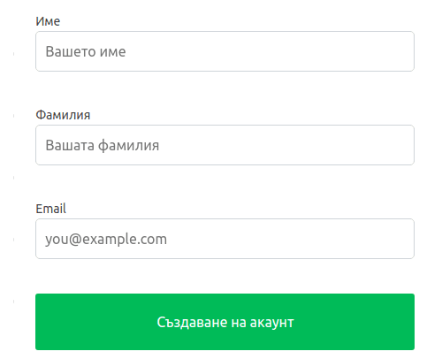
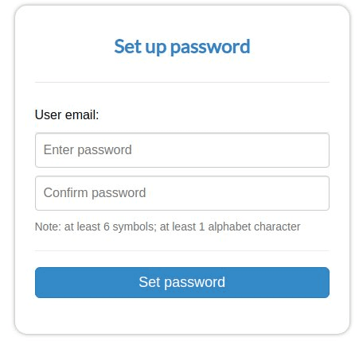

# Регистрация на потребител

За да се създаде потребителски акаунт е необходимо да се попълни формата, намираща се в началната страница на портала.
Информацията, която задължително трябва да се предостави е:
- Име
- Фамилия
- Имейл адрес
  

  
---

След кликването върху бутона "**Създаване на акаунт**" ще бъдат получени допълнителни инструкции на указания имейл, които включват:
 
- Указване на потребителска парола за акаунта. 
   

    
- Ако потребителят е въвел имейл, принадлежащ към *gmail* или *facebook* акаунт, може да влезе в системата като използва предназначените бутони без да е необходимо да указва парола.  
 

  
---
След активиране на профила, потребителят ще бъде пренасочен към системата за настройки, от където може да се достъпи Fleerp при кликване на съответната иконка или на [https://my.fleerp.com](https://my.fleerp.com)

