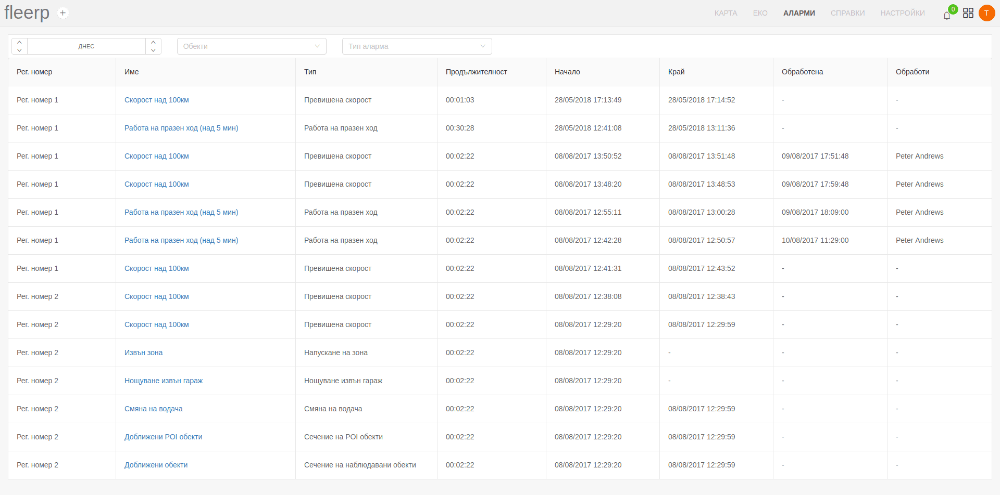
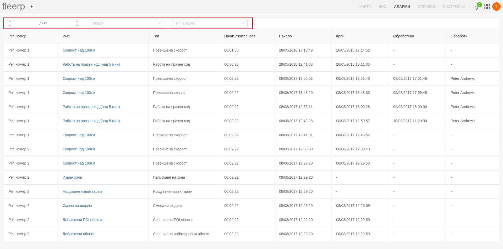
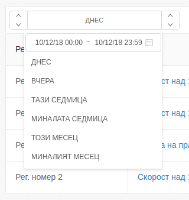
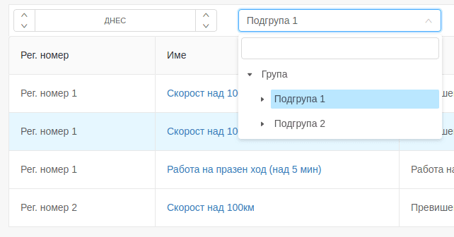

# Аларми

Понятието "Аларма" в системата Fleerp се отнася за визуализирането на информация за даден проследяващ обект,
която бива генерирана на базата на определени правила. Като пример може да послужи възникването на аларма за превишена скорост на проследяващ обект, движещ се със скорост 115 км/ч при допустими 100 км/ч.

По-подробна информация за създаване и конфигуриране на аларма може да бъде намерена в секция ["Аларми"](../web/settings/alarms) на раздел "Настройки".

В текущата секция е визуализиран списък на всички възникнали аларми в рамките на даден период.
По подразбиране списъкът съдържа всички възникнали аларми в рамките на деня.

Освен списък с аларми е налично и получаване на алармите във вид на известия, налични в лентата с меню.

# Списък с аларми

При необходимост от филтриране на информацията в списъка, това е възможно от лентата в горната част на екрана.

Потребителят може да променя зададения времеви период, с помощта на добавеният бутон.

С цел по-лесно намиране на желаната информация са добавени следните полета за филтриране: 

- по група;

- по тип на алармата

# Обработване на аларми

Всяка възникнала аларма може да бъде обработена от потребителя като по този начин се известява системата Fleerp, че са
взети необходимите мерки спрямо алармата и нейното визуализиране не е необходимо повече.

За да може да се постигне това потребителят първо трябва да влезе в екрана за обработване на аларми чрез посоченият линк.

Това, което е необходимо потребителят да направи за да обработи алармата е да кликне върху бутона "Обработи".

