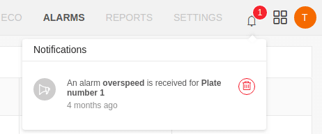
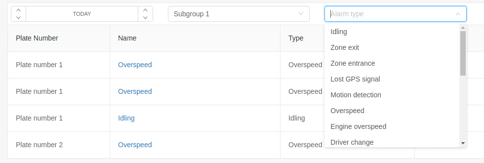
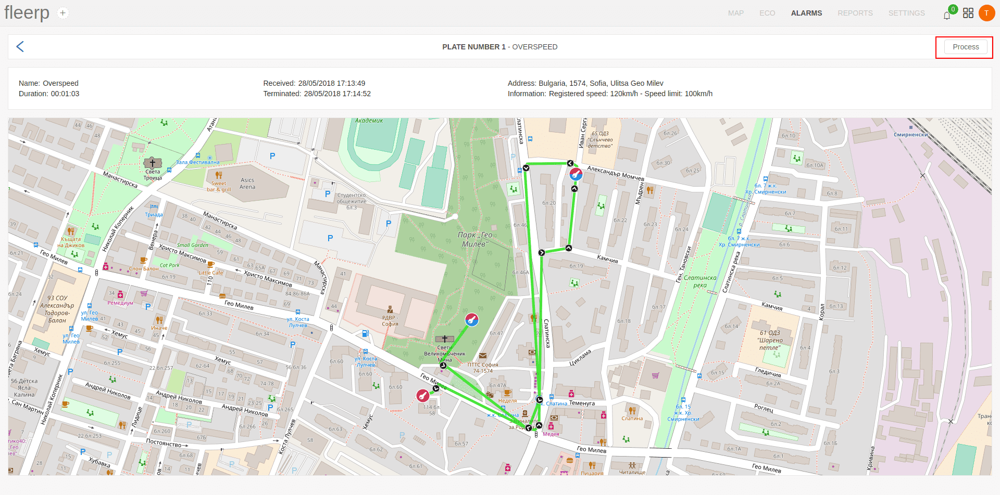

# Alarms

The term "Alarm" in the system Fleerp refers to the visualization of information about a tracking object that is generated on the basis of certain rules.
As an example, an overspeed alarm may be triggered at a tracking object moving at 115 km/h at an allowable 100 km/h.

More detailed information on creating and configuring an alarm can be found in the ["Alarms"](../web/settings/alarms) section of the "Settings" tab.

The current section displays a list of all occurrences of alarms within a given period.

By default, the list contains all occurrences of alarms within the day.

In addition to a list of alarms, alarms are available in the form of notifications available on the menu bar.

# Alarm list

If it's necessary to filter the information in the list, it is possible from the bar at the top of the screen.

The user can change the specified time period with the added button.

To make it easier to find the desired information, the following filtering fields are added:

- by group;

- by alarm type

# Alarms processing

Any alarm that has occurred can be processed by the user, notifying the Fleerp system that the necessary measures are taken against the alarm and its visualization is no longer necessary.

To achieve this, the user must first enter the alarms processing screen via the link provided.

What the user needs to do to process given alarm is to click the "Process" button.

