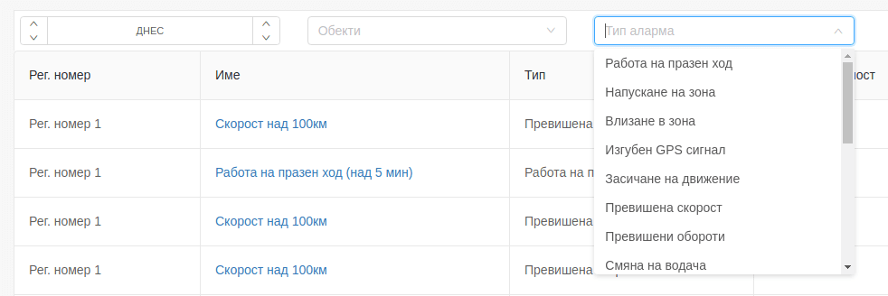

# Alarm list

If it's necessary to filter the information in the list, it is possible from the bar at the top of the screen.

The user can change the specified time period with the added button.

To make it easier to find the desired information, the following filtering fields are added:

- by group;

- by alarm type

