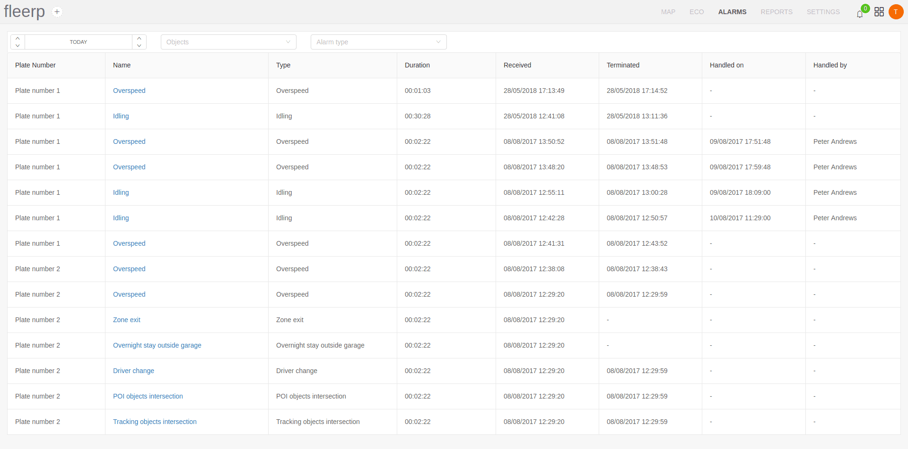

# Alarms

The term "Alarm" in the system Fleerp refers to the visualization of information about a tracking object that is generated on the basis of certain rules.
As an example, an overspeed alarm may be triggered at a tracking object moving at 115 km/h at an allowable 100 km/h.

More detailed information on creating and configuring an alarm can be found in the ["Alarms"](../web/settings/alarms) section of the "Settings" tab.

The current section displays a list of all occurrences of alarms within a given period.

By default, the list contains all occurrences of alarms within the day.

In addition to a list of alarms, alarms are available in the form of notifications available on the menu bar.

