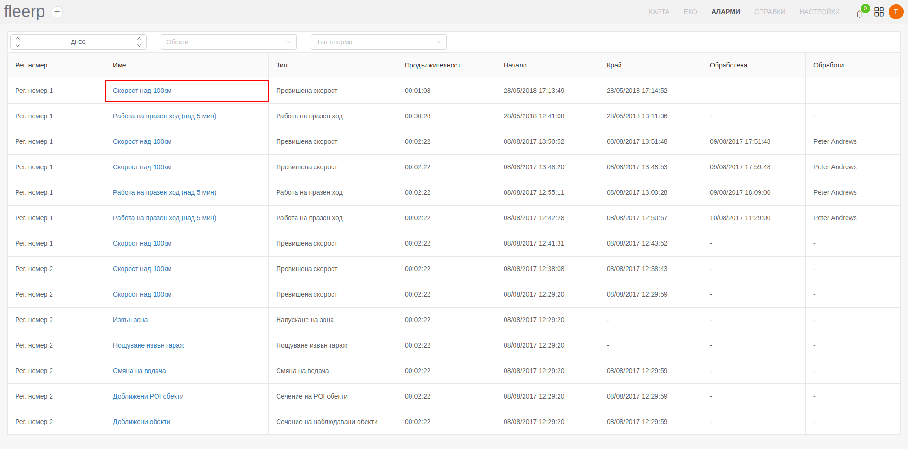

# Обработване на аларми

Всяка възникнала аларма може да бъде обработена от потребителя като по този начин се известява системата Fleerp, че са
взети необходимите мерки спрямо алармата и нейното визуализиране не е необходимо повече.

За да може да се постигне това потребителят първо трябва да влезе в екрана за обработване на аларми чрез посоченият линк.

Това, което е необходимо потребителят да направи за да обработи алармата е да кликне върху бутона "Обработи".

