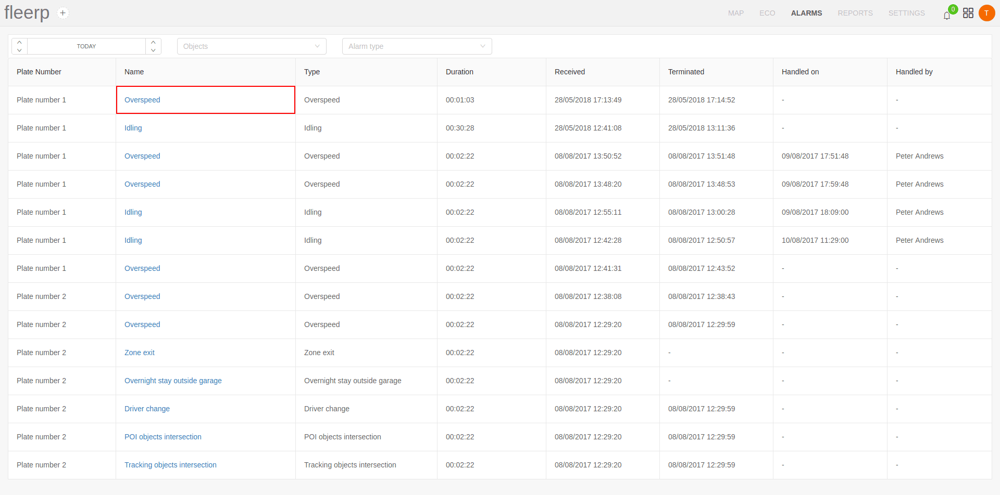

# Alarms processing

Any alarm that has occurred can be processed by the user, notifying the Fleerp system that the necessary measures are taken against the alarm and its visualization is no longer necessary.

To achieve this, the user must first enter the alarms processing screen via the link provided.

What the user needs to do to process given alarm is to click the "Process" button.

