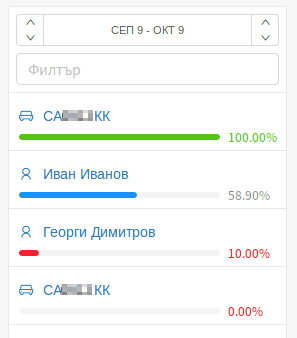
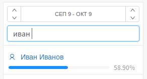
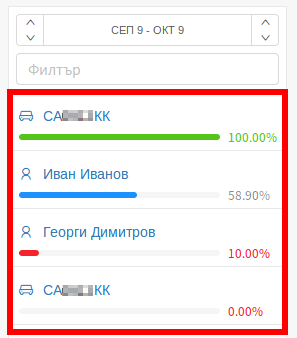
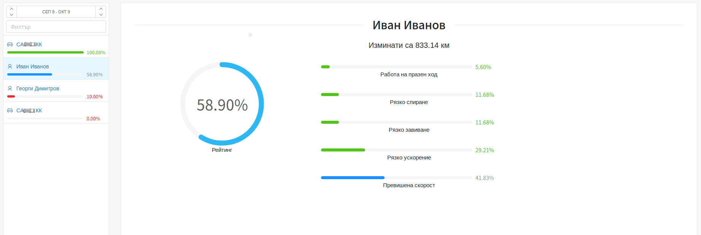
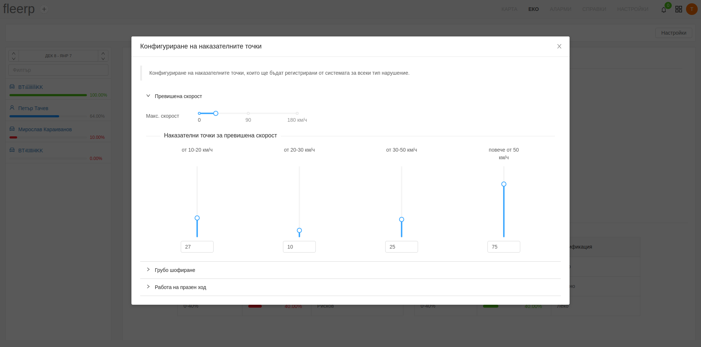
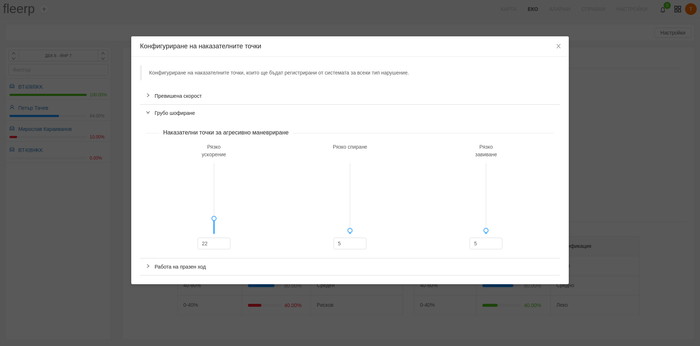
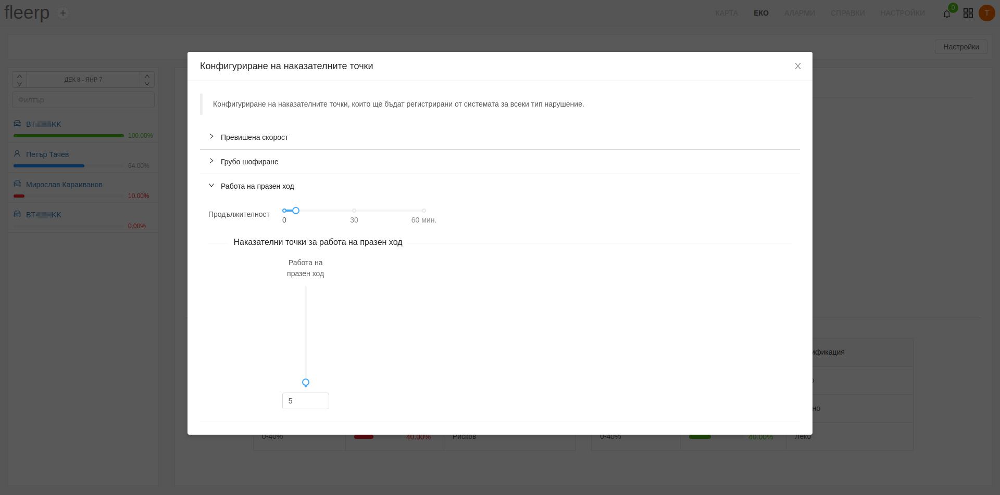

# Въведение

Ефективното използване на фирмени ресурси от служителите е ключът към успеха. В системата Fleerp е имплементирано
интелигентно решение на този проблем, предоставящо рейтинг на всеки един водач (или превозно средство, ако клиентът
не е закупил токен чипове за водачите си). Еко показателите предоставят детайлна информация относно стила на
шофиране на даден водач или превозно средство, и тяхното поведение на пътя.

Началният екран е разделен на два компонента:

- Страничен панел
- Обобщен екран

 
---

### Страничен панел

Страничният панел служи за:

- Избор на определен период от време, за което да бъде генерирана еко справка
- Търсене и селекция на конкретен водач или превозно средство, за който да бъде показан
  детайлен рейтинг, както и неговите нарушения

 
---

### Обобщен екран

Обобщеният екран съдържа: 

- детайлно обобщение, отнасящо се за организацията като цяло, т.е.
за всички водачи и превозни средства, принадлежащи към нея
- легенда на рейтинга и нарушенията

# Еко показатели

Еко показателите съчетават няколко основни функции:

- Избор на времева рамка за генериране на еко справка
- Филтриране по име или регистрационен номер
- Списък на всички водачи, както и превозните средства, които не са снабдени с токен устройство
- Селекция на водач или превозно средство

 
---

### Избор на времева рамка

Изборът на времева рамка за генериране на еко справка се прави през календара, който се появява след клик
върху вече избраните дати:

Трябва да се има предвид, че максималната времева рамка, която системата позволява за генериране на еко справка е един месец.

 
---

### Филтрация по име или регистрационен номер

Филтърът по име или регистрационен номер предоставя възможност за лесна филтрация, в случай че организацията разполага с много
на брой водачи или превозни средства.

 
---

### Списък на водачи и превозни средства, и тяхната селекция

Водачите и превозните средства са сортирани в низходящ ред по техният текущ рейтинг:

При клик върху избрания обект, в дясно се появява неговият подробен екран.

# Детайлен изглед

Детайлният изглед позволява на потребителя да види рейтинга, който се изчислява спрямо няколко критерия:

- Изминатите километри за избраната времева рамка
- Типовете наказания, които обектът е получил, както и техния брой

В лявата страна на екрана е изобразен рейтингът, а в дясната - процентното съотношение на наказанията, които е получил.

Типовете наказания биват:

- Рязко спиране
- Рязко завиване
- Рязко ускорение
- Превишена скорост
- Работа на празен ход

Системата предоставя възможност за първоначална конфигурация или промяна на настройките за чувствителност на акселерометъра
на дадено устройство чрез [_конзолата_](../../settings/tobjects/details/console/console).
                                              
# Настройки

В секцията за еко показателите е добавена възможност за допълнителни настройки, свързани с различните по вид индикатори.

Наличните настройки включват конфигуриране на наказателните точки, които ще бъдат регистрирани от системата за всеки от следните типове нарушения:
- Превишена скорост
- Грубо шофиране
- Работа на празен ход

 
---

### Превишена скорост

В секцията за **превишена скорост** е предоставена възможност за конфигуриране на:
- максималната допустима скорост на движение в интервал 0 - 180 км/ч
- зададени от потребителя наказателни точки за превишена скорост в различни интервали

### Грубо шофиране

В секцията за **грубо шофиране** е предоставена възможност за конфигуриране на наказателни точки за следните нарушения:
- рязко ускорение
- рязко спиране
- рязко завиване

### Работа на празен ход

В секцията за **работа на празен ход** е предоставена възможност за конфигуриране на:
- продължителност на времето в минути, след което да се отчитат наказателни точки
- наказателни точки за периода прекаран в работа на празен ход

