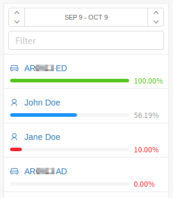
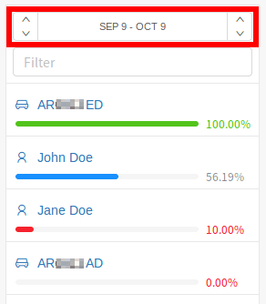
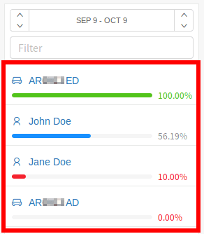
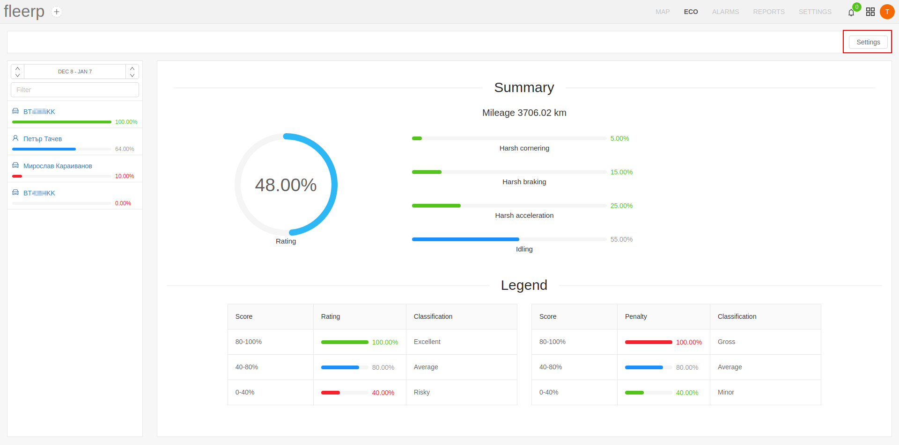
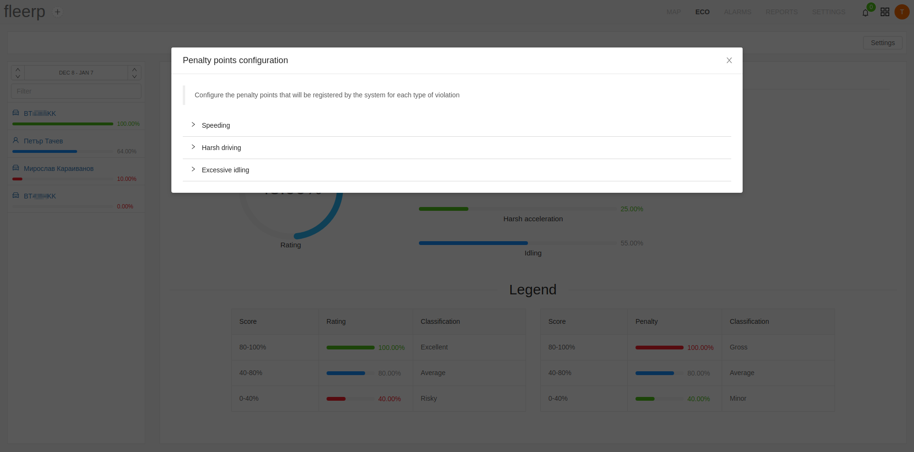

# Introduction

The effective utilizing of company resources by the employees is key to success. The Fleerp system has implemented
an intelligent solution to this problem, providing rating for every company driver (or vehicle, if the client
did not opt for token chips for his drivers). Our Eco driving provides detailed information, concerning the driving
style of a driver or vehicles, and their behaviour on the road.

The main screen is divided in two main components:

- Side panel
- Summary screen

## Side panel

The side panel serves the purpose of picking a set period of time, for which eco report to be
generated, filtering and selection of a concrete driver or vehicle, to display the corresponding
detailed rating as well as the violations.

## Summary screen

The summary screen contains:
- detailed summary, related to the organization as a whole, i.e. for all drivers (and vehicles, that do not
have driver token reader installed).
- legend for the rating and violations

# Eco driving

The eco driving panel combines several key features:

- Picking a time frame for generating an eco report
- Filtering by name or licence plate number
- Listing all drivers and vehicles, which do not have driver token reader installed
- Selection of a concrete driver or vehicle

## Picking a time frame

Picking a time frame for which eco report will be generated is accomplished by clicking on the already
selected dates, and picking new ones from the calendar that will appear:

It has to be noted that the maximum time frame, which the system allows to be picked for generating eco report, is one month.

## Filtering by name or licence plate number

The name and licence plate number filter provides easy filtration, in case the organization has many drivers or vehicles.

## Drivers and vehicles list, and their selection

The drivers and vehicles are sorted in descending order by their current eco rating.

Up on clicking on the desired object, in the right portion of the screen appears its detailed screen.

# Detailed screen

The detailed screen allows the user to see the eco rating, which is calculated by several different factors:

- The mileage travelled for the selected time frame
- The types of penalties that the object received, as well as their number

The rating is shown in the left portion of the screen, in the right portion - the percent ratio of the penalties, that
the object has received.

The types of penalties are as follows:

- Harsh braking
- Harsh cornering
- Harsh acceleration
- Overspeed
- Idling

The system provides a tool for initial configuration or corrections in the sensitivity settings of the accelerometer of
a given device through the [_console_](../../settings/tobjects/details/console/consol).

# Settings

In the eco driving section is provided an option for additional configuration of the settings, related with the various eco indicators.

The available settings includes configuration of penalty points which will be registered by the system for each of the following types of violations:

- Speeding
- Harsh driving
- Excessive idling

## Speeding

The **speeding** section provides an option for configuration of:
- the maximum allowable speed of movement at interval 0 - 180 km/h
- penalty points which are defined by the user for speeding at different intervals

## Harsh driving

The **harsh driving** section provides an option for configuration of penalty points for the following violations:
- Harsh acceleration
- Harsh braking
- Harsh cornering

## Excessive idling

The **excessive idling** section provides an option for configuration of:
- the time duration in minutes after which the penalty points are applied
- penalty points for the idling period

