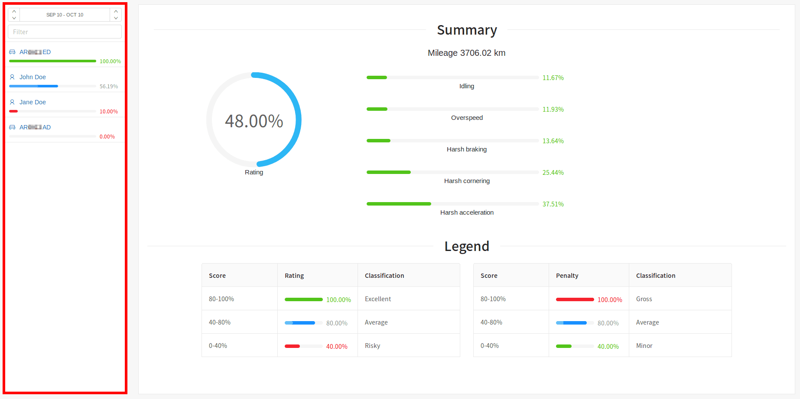

# Eco driving

The effective utilizing of company resources by the employees is key to success. The Fleerp system has implemented
an intelligent solution to this problem, providing rating for every company driver (or vehicle, if the client
did not opt for token chips for his drivers). Our Eco driving provides detailed information, concerning the driving
style of a driver or vehicles, and their behaviour on the road.

The main screen is divided in two main components:

- Side panel
- Summary screen

### Side panel

The side panel serves the purpose of picking a set period of time, for which eco report to be
generated, filtering and selection of a concrete driver or vehicle, to display the corresponding
detailed rating as well as the violations.

 
---

### Summary screen

The summary screen contains:
- detailed summary, related to the organization as a whole, i.e. for all drivers (and vehicles, that do not
have driver token reader installed).
- legend for the rating and violations

