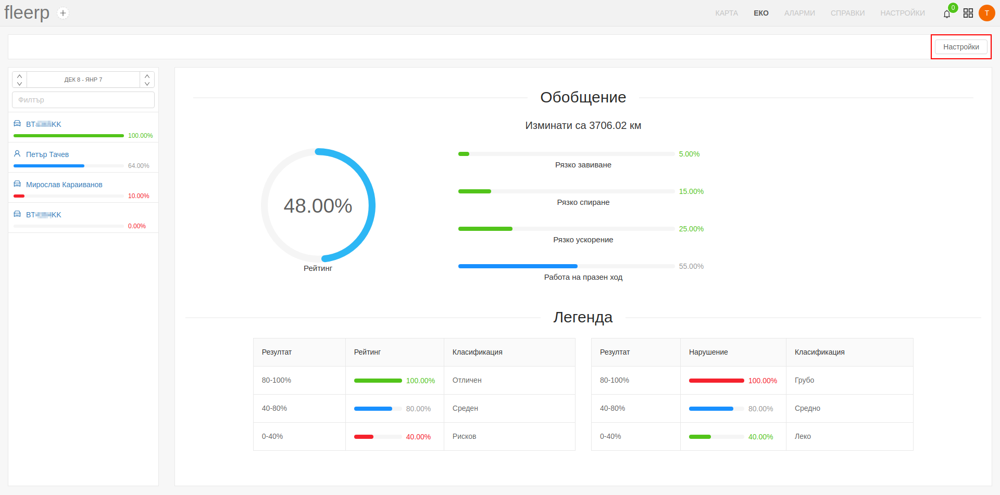
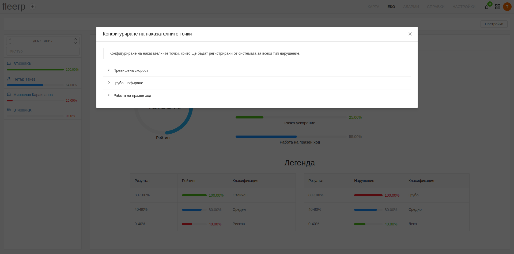

# Настройки

В секцията за еко показателите е добавена възможност за допълнителни настройки, свързани с различните по вид индикатори.

Наличните настройки включват конфигуриране на наказателните точки, които ще бъдат регистрирани от системата за всеки от следните типове нарушения:
- Превишена скорост
- Грубо шофиране
- Работа на празен ход

### Превишена скорост

В секцията за **превишена скорост** е предоставена възможност за конфигуриране на:
- максималната допустима скорост на движение в интервал 0 - 180 км/ч
- зададени от потребителя наказателни точки за превишена скорост в различни интервали

### Грубо шофиране

В секцията за **грубо шофиране** е предоставена възможност за конфигуриране на наказателни точки за следните нарушения:
- рязко ускорение
- рязко спиране
- рязко завиване

### Работа на празен ход

В секцията за **работа на празен ход** е предоставена възможност за конфигуриране на:
- продължителност на времето в минути, след което да се отчитат наказателни точки
- наказателни точки за периода прекаран в работа на празен ход

