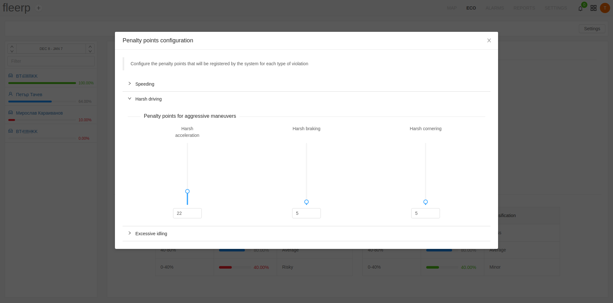

# Settings

In the eco driving section is provided an option for additional configuration of the settings, related with the various eco indicators.

The available settings includes configuration of penalty points which will be registered by the system for each of the following types of violations:

- Speeding
- Harsh driving
- Excessive idling

### Speeding

The **speeding** section provides an option for configuration of:
- the maximum allowable speed of movement at interval 0 - 180 km/h
- penalty points which are defined by the user for speeding at different intervals

### Harsh driving

The **harsh driving** section provides an option for configuration of penalty points for the following violations:
- Harsh acceleration
- Harsh braking
- Harsh cornering

### Excessive idling

The **excessive idling** section provides an option for configuration of:
- the time duration in minutes after which the penalty points are applied
- penalty points for the idling period

