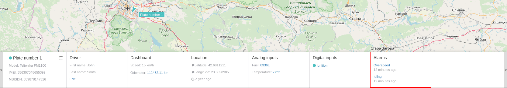

# Alarms

Visualized information includes details for every occurred alarm:

- alarm name;
- time period since alarm is created;

Additional information is available after click on the name of given alarm.

