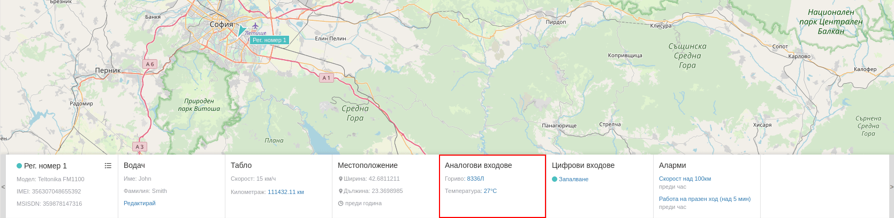

# Аналогови входове

Визуализираната информация включва детайли за всеки добавен аналогов вход:
- име на аналоговия вход;
- измерена стойност;

Достъпна е допълнителна информация във вид на графика при клик върху стойността на даден аналогов вход.

