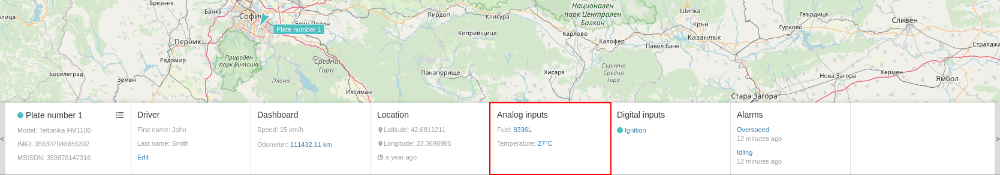
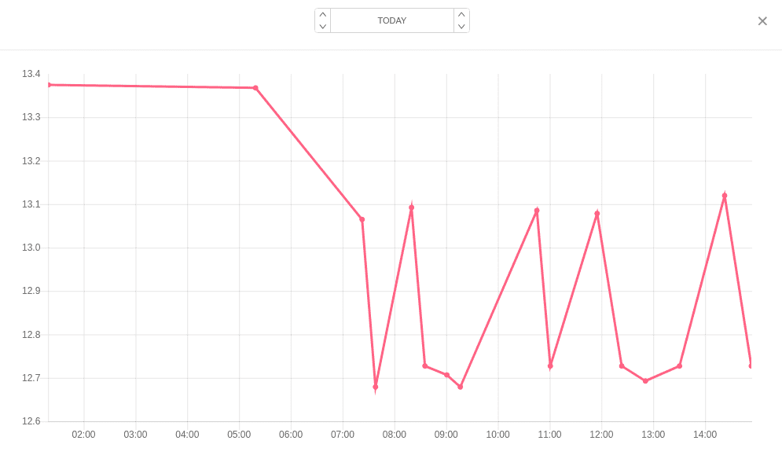

# Analog inputs

Visualized information includes details for every added analog input:
- name of the input;
- measured value;

Additional information is available in the form of line chart after click on value of given analog input.

