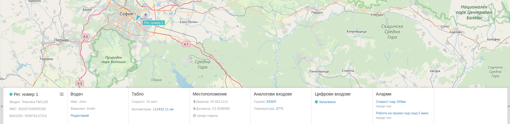

# Панел с детайли

При клик върху даден проследяващ обект в долната част на екрана се визуализира панел с детайлна информация.

Панелът е съставен от индивидуални секции, даващи допълнителна информация за избрания обект: 

 - обща информация;
 - информация за водача;
 - информация за таблото;
 - информация за местоположението;
 - информация за аналогови входове;
 - информация за цифрови входове;
 - информация за възникнали аларми;
