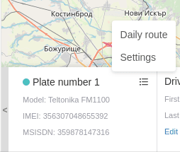
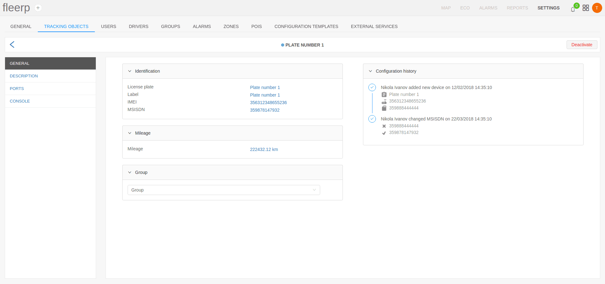

# Main

Visualized information includes:
- current status;
- model of the device
- IMEI number;
- MSISDN number;

Additional information is available via added menu.

The option for "Daily route" will visualize the route for the day.

The option for "Settings" will redirect the user to a screen where the object information can be edited.

