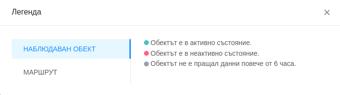
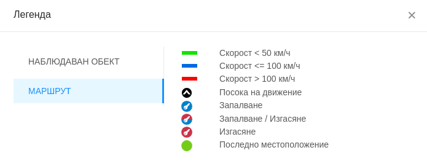

# Легенда

С цел по-лесно разбиране на различните елементи от екрана е налична легенда, която може да бъде достъпена през добавения бутон.

Описанието включва: 

- състоянието на наблюдаван обект;

- детайли при визуализация на маршрут;

