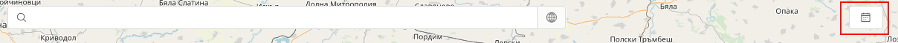

# Legend

In order to make it easier to understand different elements of the screen, a legend is available via the dedicated button.

The description includes:

- tracking object's status

- details of visualized route;

