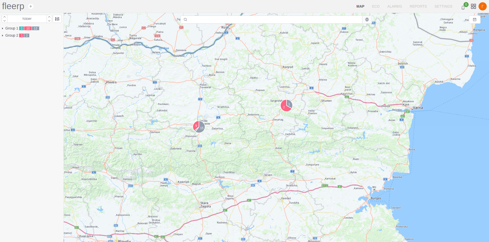

# Main screen

In the main screen of the map are visualized all available tracking objects, the change in their locations is observed in real time.

If there are large number of tracking objects on the map it is possible their representation to be in the form of clusters,
which combine objects that are close one to another. The scale of visualization can be changed with the mouse scroll.

