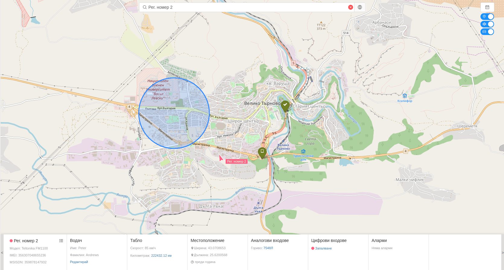

# Търсене на проследяващ обект

Търсенето на обект може да се извърши по един от следните критерии:
 - регистрационен номер;
 - етикет;
 - IMEI номер;
 - MSISDN номер;

Като резултат освен позицията на обекта, на екрана ще се визуализират всички зони и точки на интерес в близост до обекта.
