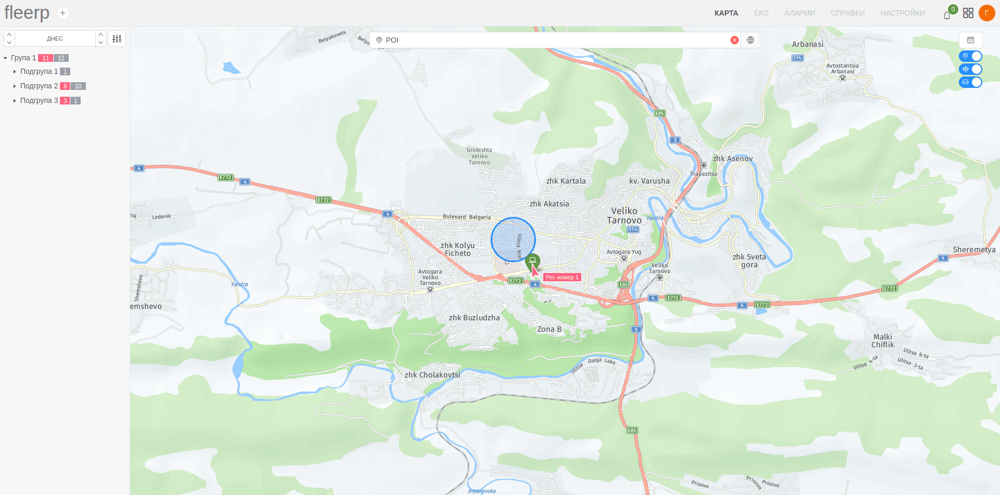

# Търсене на точка на интерес (POI)

Търсенето на точка на интерес може да се извърши по критерий име на poi.

Като резултат освен позицията на POI, на екрана ще се визуализират всички зони и проследяващи обекти в близост.

