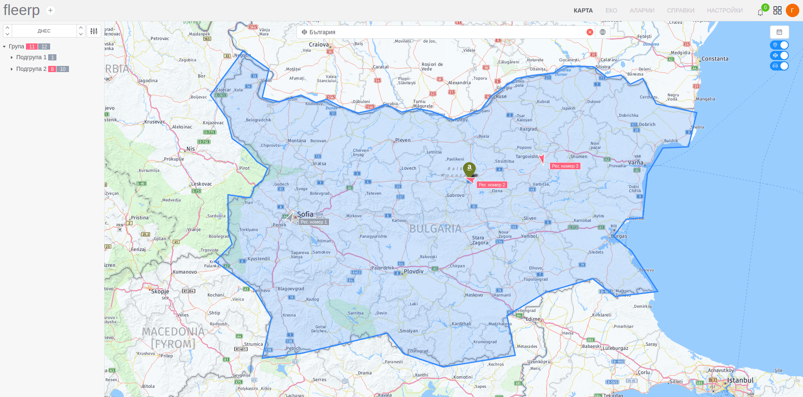

# Търсене на зона

Търсенето на зона може да се извърши по критерий име на зона.

Като резултат освен позицията на зоната, на екрана ще се визуализират всички проследяващи обекти и точки на интерес, които попадат в нея.
