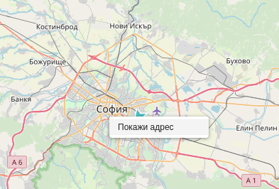
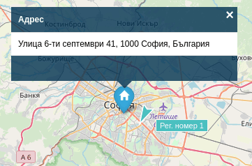

# Намиране на адрес върху картата

При необходимост да се намери местоположението на даден адрес, това може да се извърши чрез клик с десен бутон
върху картата. От контекстното меню е достъпна опция "Покажи адрес".

Като резултат от нея ще се появи адресът на посоченото място отбелязан върху картата.

