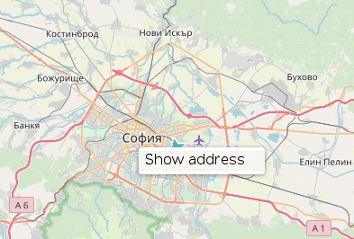
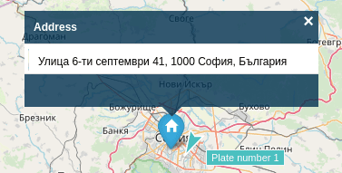

# Find address on the map

If it's necessary to find the location of given address, that can be performed with right click on the mouse somewhere on the map.
From the context menu is available option "Show address".

As a result from it, the location of the address will be visualized on the map.

