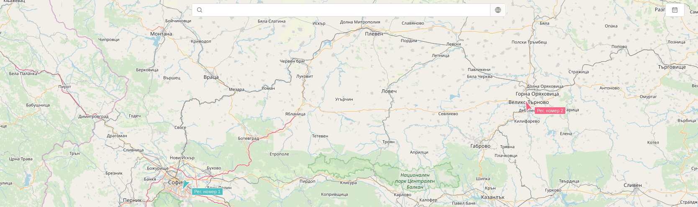
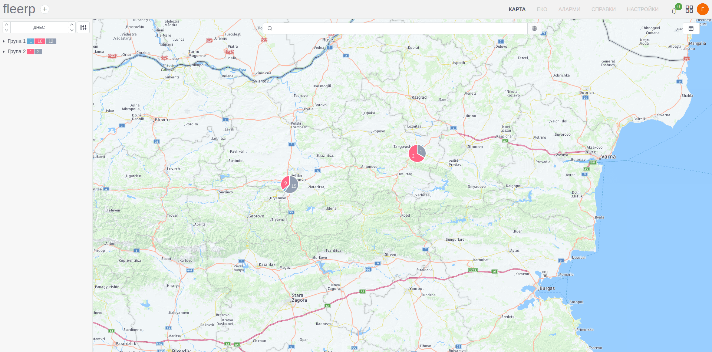
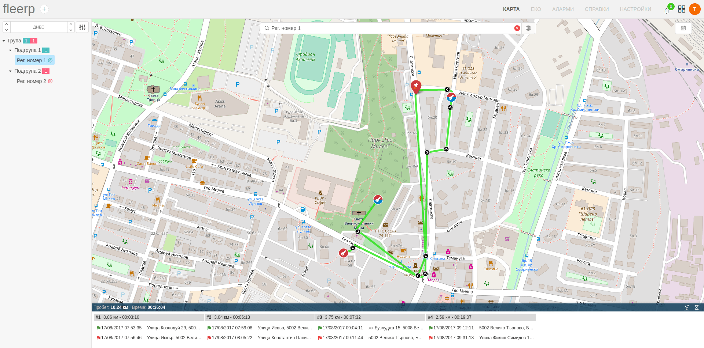
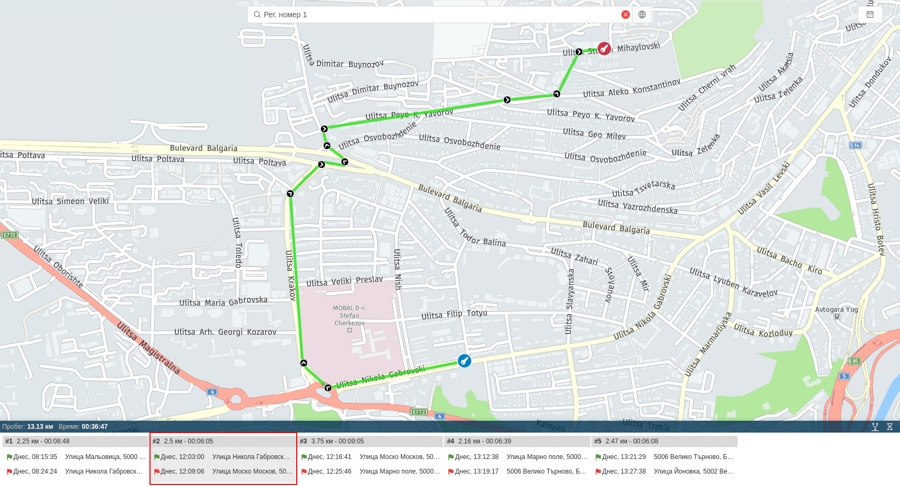

# Основен екран

В основния екран на картата се визуализират наличните проследяващи обекти, като промяната на тяхното местоположение
се наблюдава в реално време.

При наличието на много на брой проследяващи обекти върху картата е възможно представяне във вида на отделни групи,
обединяващи обектите в близост един до друг. Мащаба на визуализация може да се променя със скрол с мишката.

# Панел с пътен лист

 При избор на даден проследяващ обект от дървото, в долната част на екрана се визуализира панел с пътния лист в рамките на зададения период.
 
 
 
 При кликване върху различните секции от пътния лист, на екрана ще бъде визуализиран съответният маршрут.
 
 
