# Начало

Картата е основен елемент от системата Fleerp, чиято цел е да предостави лесен и удобен начин за наблюдаване в реално време на проследяващите обекти.

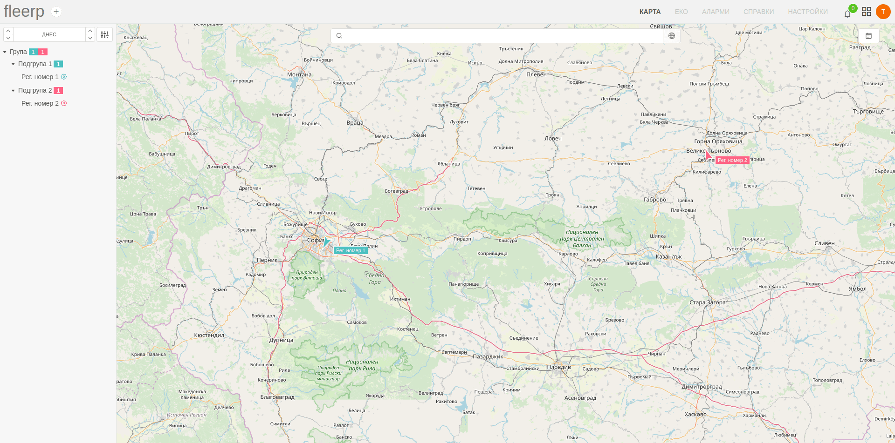

Основни функции: 

- визуализация на всички проследяващи обекти;

- детайлна информация за даден проследяващ обект;
 
- визуализация на изминат маршрут за даден обект;
 
- търсене на обекти;
  
- търсене на местоположение по даден адрес;

Секцията се състои от два основни елемента: 

- основен екран;

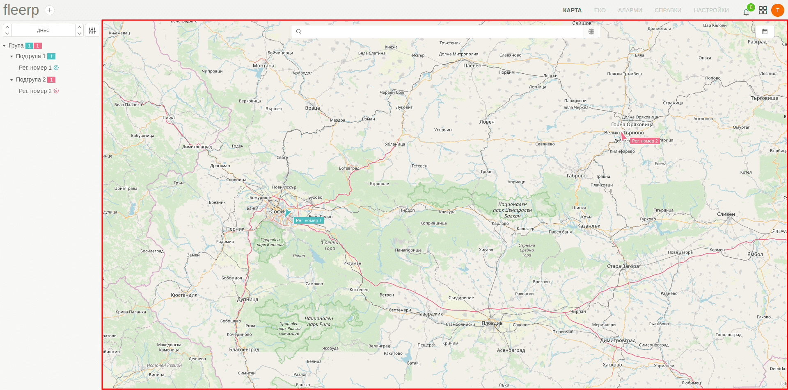

- страничен панел;

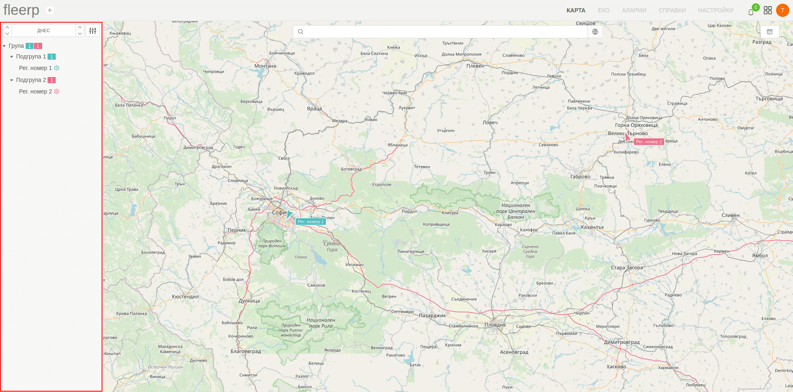

# Основен екран

В основния екран на картата се визуализират наличните проследяващи обекти, като промяната на тяхното местоположение
се наблюдава в реално време.

При наличието на много на брой проследяващи обекти върху картата е възможно представяне във вида на отделни групи,
обединяващи обектите в близост един до друг. Мащаба на визуализация може да се променя със скрол с мишката.

# Панел с пътен лист

При избор на даден проследяващ обект от дървото, в долната част на екрана се визуализира панел с пътния лист в рамките на зададения период.
 

 
При кликване върху различните секции от пътния лист, на екрана ще бъде визуализиран съответният маршрут.
 

# Панел с машина на времето

От лентата на панела с информация освен пътен лист е достъпен и режим "Машина на времето", който изобразява
анимация на изминатия маршрут на дадения проследяващ обект.

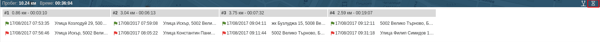

При избор на тази възможност се визуализира избраният режим, като за да се даде начало на анимацията
е необходимо да се кликне върху бутона за възпроизвеждане.

Налична е възможност за промяна на скоростта на възпроизвеждане с помощта на бутоните x1, x2 или x3.

Резултатът от възпроизвеждането би изглеждал така

# Панел с детайли

При клик върху даден проследяващ обект в долната част на екрана се визуализира панел с детайлна информация.

Панелът е съставен от индивидуални секции, даващи допълнителна информация за избрания обект: 

 - обща информация;
 - информация за водача;
 - информация за таблото;
 - информация за местоположението;
 - информация за аналогови входове;
 - информация за цифрови входове;
 - информация за възникнали аларми;

## Обща информация

Визуализираната информация включва:
- текущ статус;
- модел на устройството;
- IMEI номер;
- MSISDN номер;

Достъпна е допълнителна информация през добавеното меню.

Опцията за "Дневен маршрут" ще визуализира изминатия маршрут за деня.

Опцията за "Настойки" ще отведе потребителя към екран за редактиране на обекта.

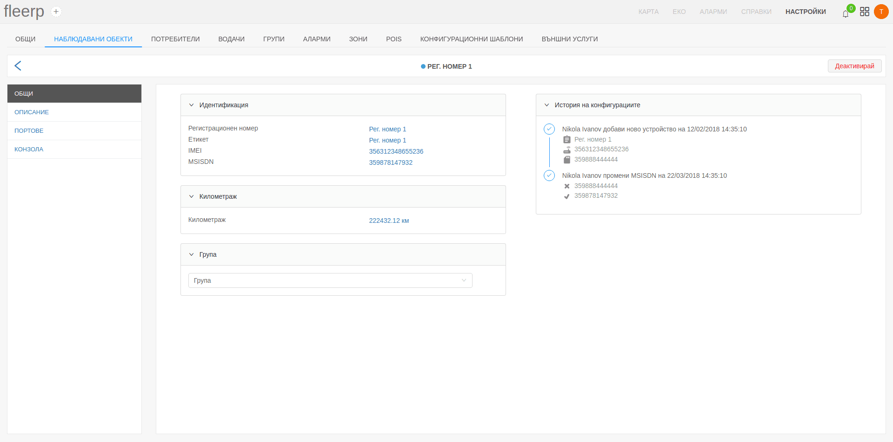

## Водач

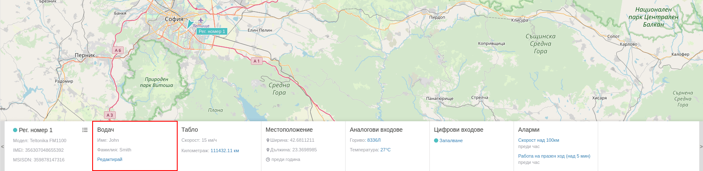

Визуализираната информация включва:
- име на водача;
- фамилия на водача;

Възможна е опция за промяна на наличната информация чрез добавения линк "Редактирай".
Клик върху него ще отведе потребителя към екран за допълнителна редакция.

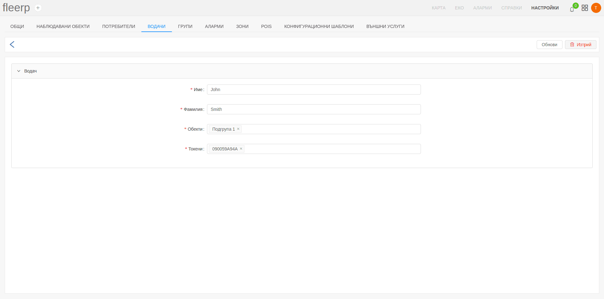 

## Табло

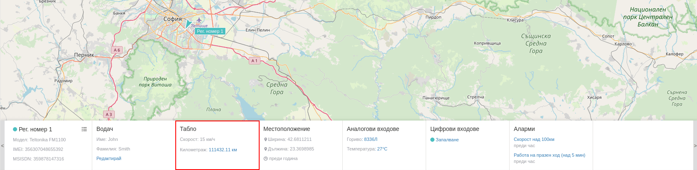

Визуализираната информация включва:
- последно измерена скорост на движение;
- натрупан километраж за обекта;

Възможна е опция за промяна на километража чрез добавения линк за редакция.

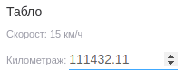

## Местоположение

Визуализираната информация включва:
- географска ширина;
- географска дължина;
- изминало време от последнтата комуникация с обекта;

## Аналогови входове

Визуализираната информация включва детайли за всеки добавен аналогов вход:
- име на аналоговия вход;
- измерена стойност;

Достъпна е допълнителна информация във вид на графика при клик върху стойността на даден аналогов вход.

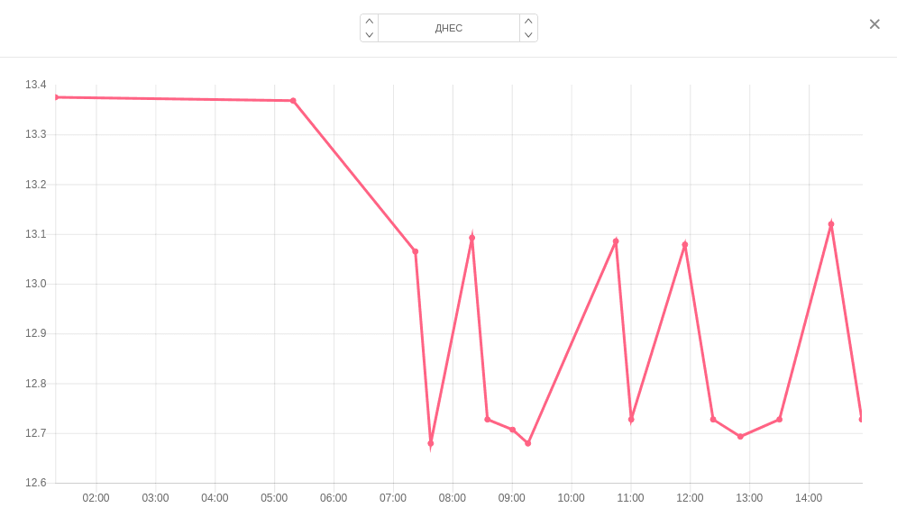

## Цифрови входове

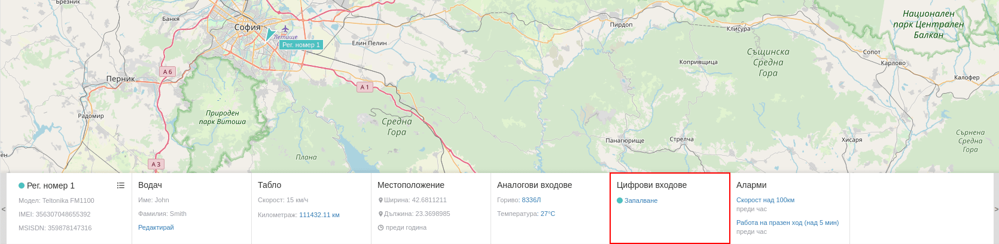

Визуализираната информация включва информация за всеки добавен цифров вход:
- статус на входа - включен/изключен
- име на цифровия вход;

Достъпна е допълнителна информация във вид на графика при клик върху името на даден цифров вход.

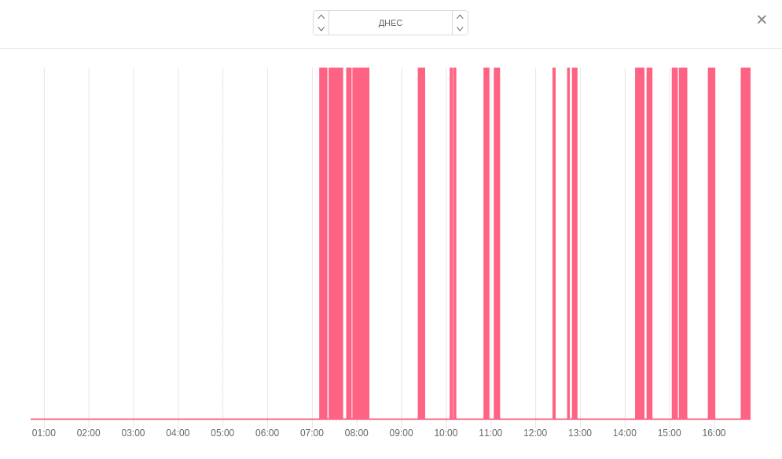

## Аларми

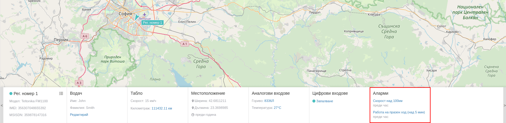

Визуализираната информация включва детайли за всяка възникнала аларма:
- име на алармата;
- време от възникване на алармата;

Достъпна е допълнителна информация при клик върху името на дадена аларма.

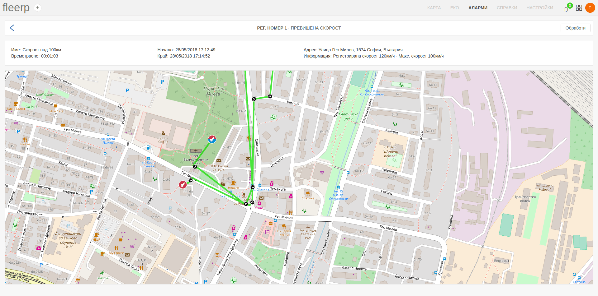

# Намиране на адрес върху картата

При необходимост да се намери местоположението на даден адрес, това може да се извърши чрез клик с десен бутон
върху картата. От контекстното меню е достъпна опция "Покажи адрес".

Като резултат от нея ще се появи адресът на посоченото място отбелязан върху картата.

# Търсене по карта

Налична е възможност за търсене по картата на:
 - проследяващи обекти;
 - зони;
 - точки на интерес;
 - водачи;

Резултатът може да бъде скриван или показван чрез съответните бутони.

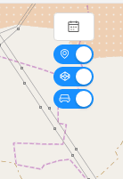

При необходимост да се намери даден адрес може да се ползва предоставеният бутон за гео търсене.

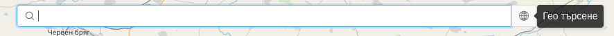

След кликването върху него трябва да се въведе и самият адрес, чиято позиция ще бъде посочена на картата.

## Търсене на проследяващ обект

Търсенето на обект може да се извърши по един от следните критерии:
 - регистрационен номер;
 - етикет;
 - IMEI номер;
 - MSISDN номер;

Като резултат освен позицията на обекта, на екрана ще се визуализират всички зони и точки на интерес в близост до обекта.

## Търсене на зона

Търсенето на зона може да се извърши по критерий име на зона.

Като резултат освен позицията на зоната, на екрана ще се визуализират всички проследяващи обекти и точки на интерес, които попадат в нея.

## Търсене на точка на интерес (POI)

Търсенето на точка на интерес може да се извърши по критерий име на poi.

Като резултат освен позицията на POI, на екрана ще се визуализират всички зони и проследяващи обекти в близост.

## Търсене на водач

Търсенето на водач може да се извърши по критерий име на водача.

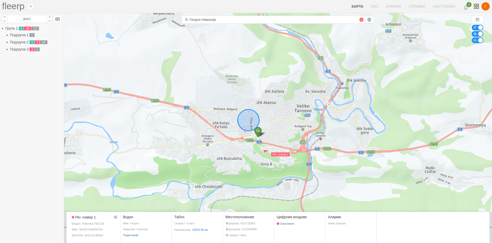

Като резултат освен позицията на водача, на екрана ще се визуализират всички зони и точки на интерес в близост.

# Намиране на обект за проследяване

В страничния панел на картата се визуализират всички налични проследяващи обекти.

## Селектиране на обекти

Предоставената дървовидна структура в панела дава възможност за избор на визуализация за:
 - всички налични проследяващи обекти; 
 - само за проследяващи обекти от дадена група;

При селектиране на група от дървото, върху картата се визуализират само тези обекти, които са част от нея.

Ако потребителят избере най-главната група, тогава върху картата ще се появят всички налични обекти, намиращи се във всички групи.

При избор на дадена подгрупа, върху картата ще се появят само принадлежащите към нея обекти.

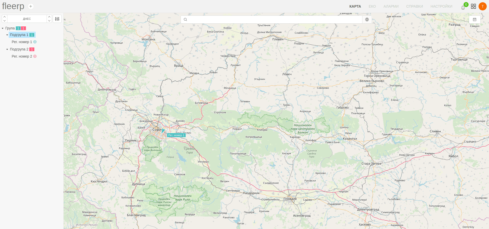

При деселектиране на дадена група, върху картата се изобразяват всички налични проследяващи обекти.

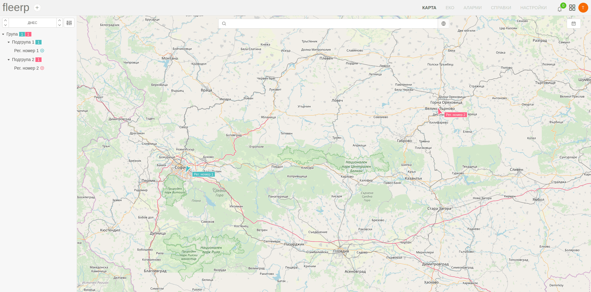

Визуализацията на маршрут при избор на даден обект от някоя група, по подразбиране е на дневна база.

При необходимост периодът може да бъде променян от потребителя спрямо неговите нужди от предоставения за целта бутон.

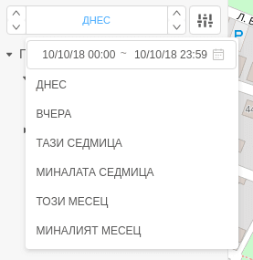

Предоставена е възможност за допълнителни настройки, свързани с визуализацията на обекти върху картата.

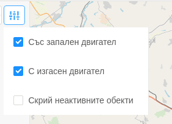

## Статус на проследяващите обекти

В панела освен името на всяка група е достъпна информация и за статуса и броя на обектите, принадлежащи към нея.

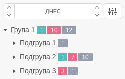

Информацията, посочена за всяка група е сумарна за всички подгрупи в нея.

Описание на статусите:

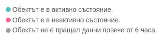

# Легенда

С цел по-лесно разбиране на различните елементи от екрана е налична легенда, която може да бъде достъпена през добавения бутон.

Описанието включва: 

- състоянието на наблюдаван обект;

- детайли при визуализация на маршрут;

