# Introduction

The map is fundamental element of the Fleerp system which main purpose is to provide easy and convenient way of object tracking in real time.

Main features:

- visualization of all tracking objects;

- detailed information about given tracking object;
 
- visualization of route for given tracking object;
 
- tracking object search;
  
- finding location by address

The section is composed by two elements: 

- main screen;

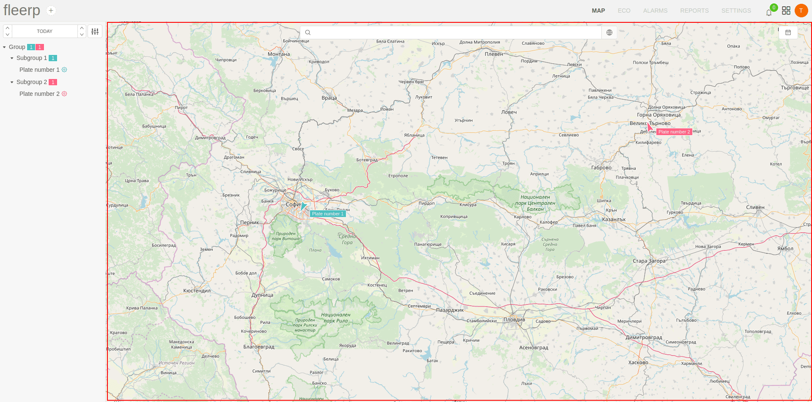

- sidebar;  

# Main screen

In the main screen of the map are visualized all available tracking objects, the change in their locations is observed in real time.

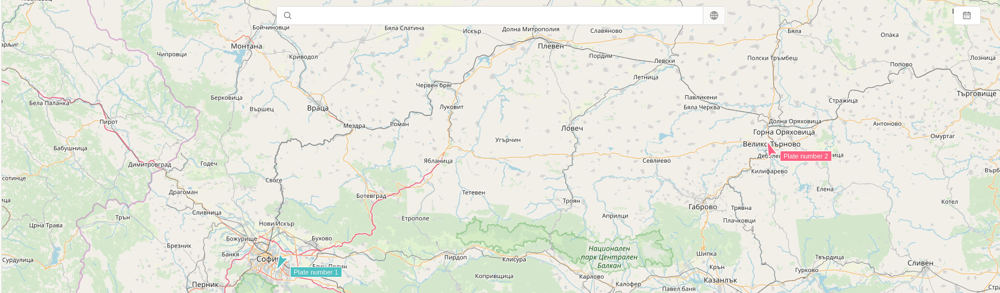

If there are large number of tracking objects on the map it is possible their representation to be in the form of clusters,
which combine objects that are close one to another. The scale of visualization can be changed with the mouse scroll.

# Trips panel
 
 When tracking object is selected from the tree, in the bottom part of the screen is visualized panel with the trips made for the given period.
 
 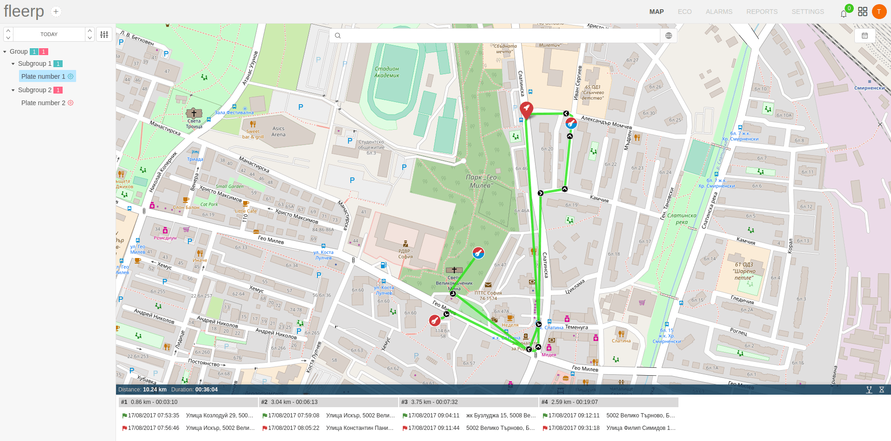
  
 After click on different sections from trips list, on the screen will be visualized the corresponding route.
 
 

# Detailed panel

After click on given tracking object, in the bottom part of the screen is visualized panel with detailed information.

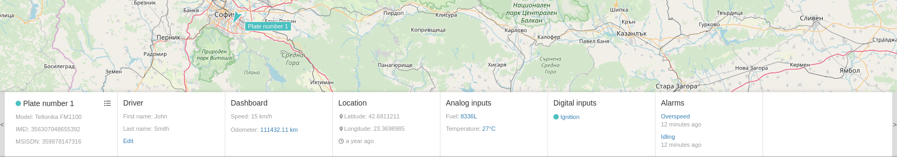

The panel consists of individual sections which provides additional information about the selected tracking object:

 - general information;
 - information about driver;
 - information about dashboard;
 - information about location;
 - information about analog inputs;
 - information about digital inputs;
 - information about occurred alarms;

## Main

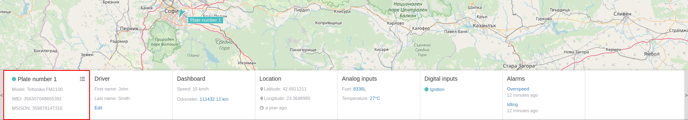

Visualized information includes:
- current status;
- model of the device
- IMEI number;
- MSISDN number;

Additional information is available via added menu.

The option for "Daily route" will visualize the route for the day.

The option for "Settings" will redirect the user to a screen where the object information can be edited.

## Driver

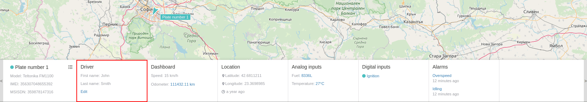

Visualized information includes:
- name of the driver;
- family name of the driver;

It is possible to perform change in driver's details from the provided "Edit" link.

After click on the link the user will be redirected to a screen where all information can be edited.

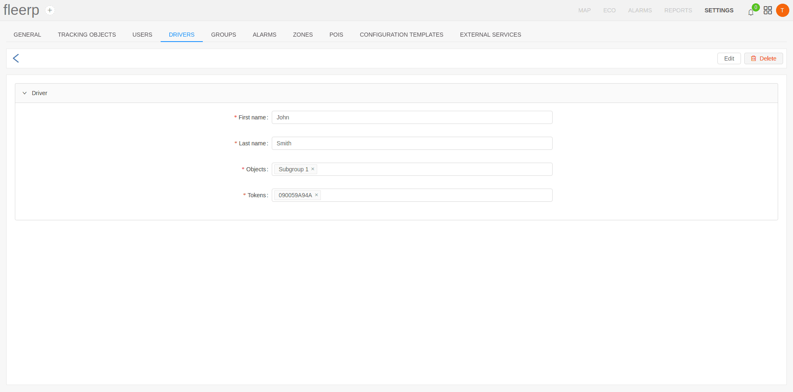 

## Dashboard

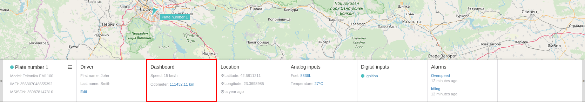

Visualized information includes:
- last measured speed;
- accumulated mileage for the tracking object;

It is possible to perform change in odometer's value from the provided link.

## Location

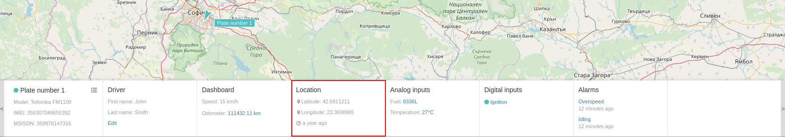

Visualized information includes:
- latitude;
- longitude;
- time period since last communication with the tracking object;

## Analog inputs

Visualized information includes details for every added analog input:
- name of the input;
- measured value;

Additional information is available in the form of line chart after click on value of given analog input.

## Digital inputs

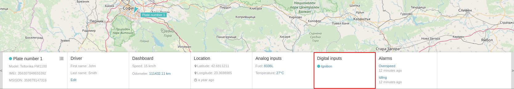

Visualized information includes details for every added digital input:
- input status - on/off;
- name of the digital input;

Additional information is available in the form of graphic after click on name of given digital input.

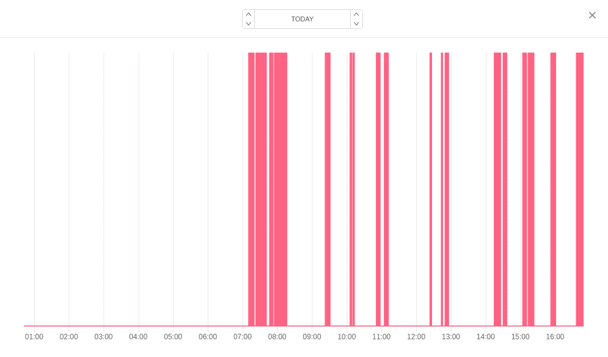

## Alarms

Visualized information includes details for every occurred alarm:

- alarm name;
- time period since alarm is created;

Additional information is available after click on the name of given alarm.

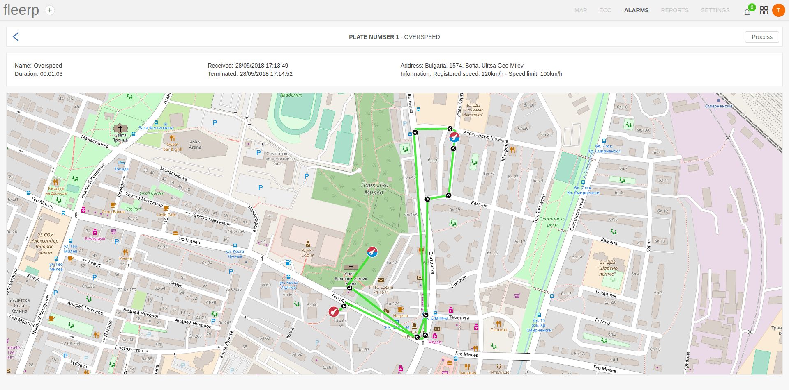

# Find address on the map

If it's necessary to find the location of given address, that can be performed with right click on the mouse somewhere on the map.
From the context menu is available option "Show address".

As a result from it, the location of the address will be visualized on the map.

# Search on map

Search on the map is available for:
 - tracking objects;
 - zones;
 - points of interest;
 - drivers;

The result can be hidden or displayed through the corresponding buttons.

If necessary to find an address, the provided geo search button can be used.

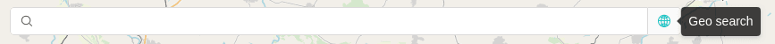

After click on it, an address need to be entered, which position will be visualized on the map .

## Tracking object search

Object search can be performed on one of the following criteria:
 - plate number;
 - label;
 - IMEI number;
 - MSISDN number;

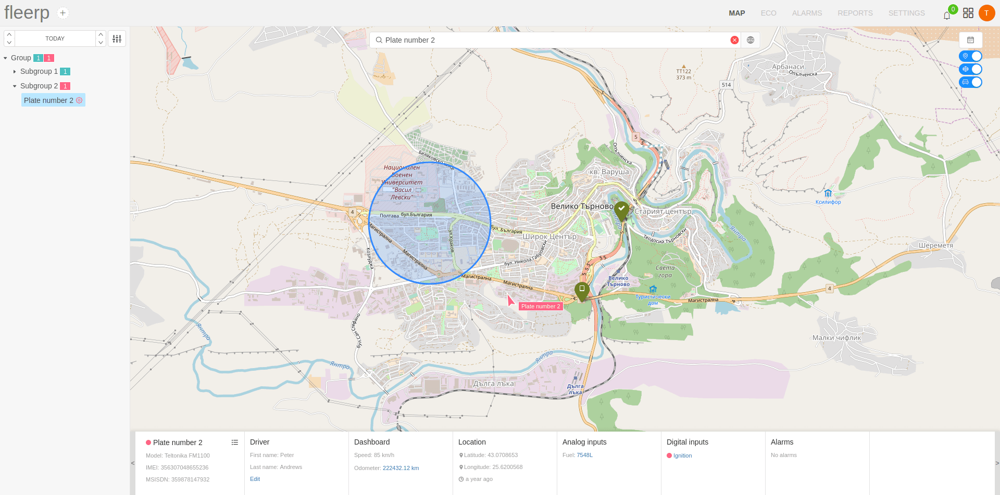

As a result, in addition to the position of the object, all zones and points of interest near the object will be displayed on the screen.

## Zone search

Zone search can be performed according to the zone's name criterion.

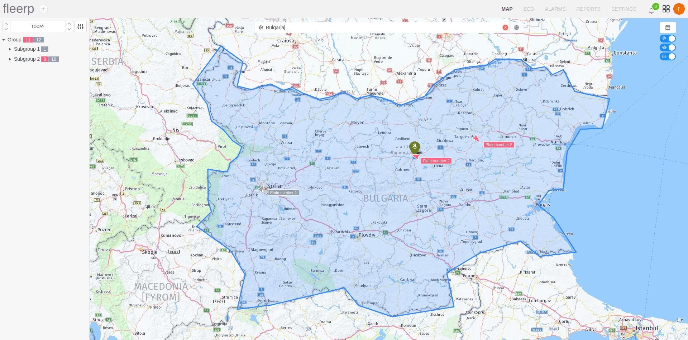

As a result, in addition to the position of the zone, all the tracking objects and points of interest that fall within it will be displayed on the screen.

## Point of interest (POI) search

POI search can be performed according to the poi's name criterion.

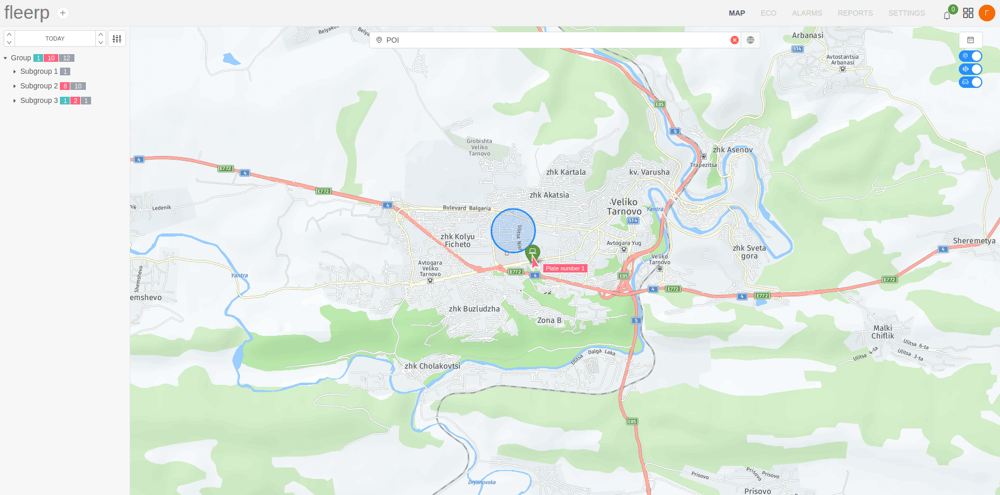

As a result, besides the position of the POI, all zones and tracking objects in the vicinity will be displayed on the screen.

## Driver search

Driver search can be performed according to the driver's name criterion.

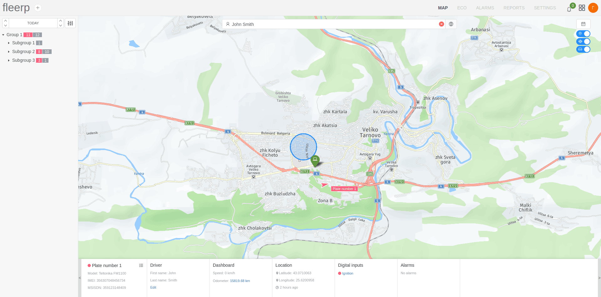

As a result, in addition to the driver's position, all zones and points of interest nearby will be displayed on the screen.

# Finding a tracking object

In the sidebar of the map are visualized all available tracking objects.

## Object selection

The provided tree structure in the panel allows you to select a visualization for:
 - all available tracking objects; 
 - only for tracking objects which belong to given group;

When selecting a tree group, only those objects that are part of it are displayed on the map.

If the user chooses the most top level group, then all available objects located in all groups will appear on the map.

When selecting a subgroup, only the objects belonging to it will appear on the map.

When a group is deselected, all available tracking objects are displayed on the map.

Visualization of route when selecting an object from a group, by default, is on a daily basis.

If necessary, the period can be changed by the user according to his needs from the provided button.

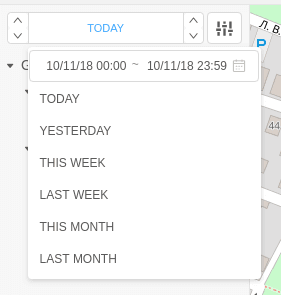

Additional settings related to object visualization on the map are provided.

## Object status

Inside the panel, besides the name of each group, information is also available on the status and number of objects belonging to it.

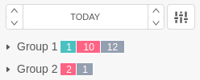

The information given for each group is aggregated for all subgroups in it.

Status description: 

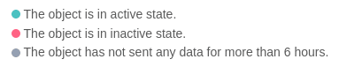

# Legend

In order to make it easier to understand different elements of the screen, a legend is available via the dedicated button.

The description includes:

- tracking object's status

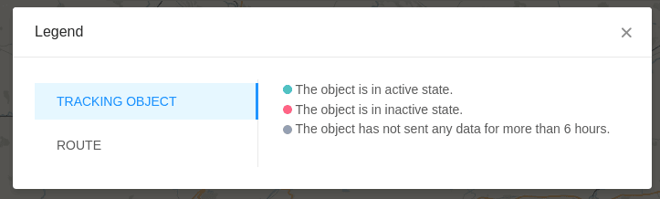

- details of visualized route;

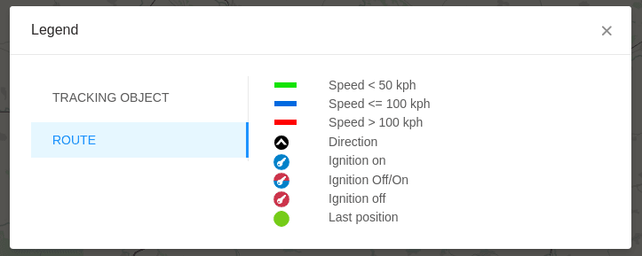
