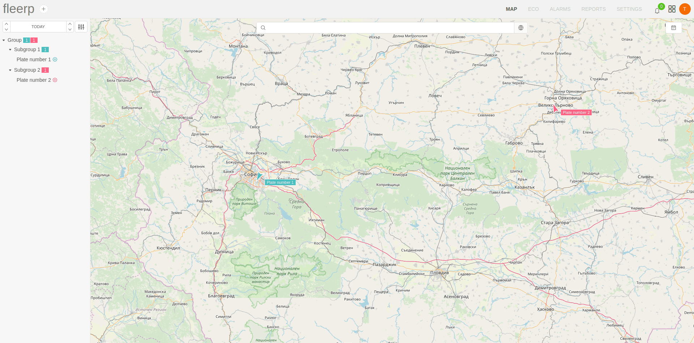
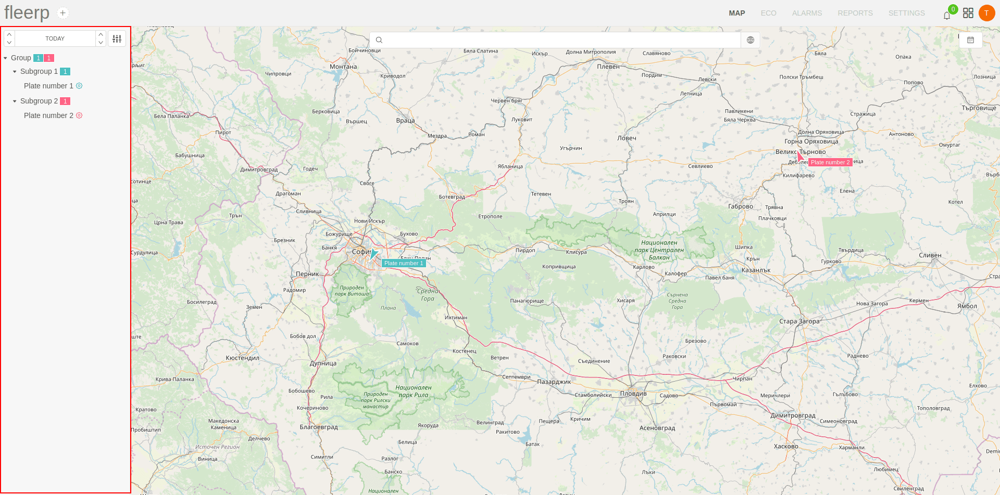

# Map

The map is fundamental element of the Fleerp system which main purpose is to provide easy and convenient way of object tracking in real time.

Main features:

- visualization of all tracking objects;

- detailed information about given tracking object;
 
- visualization of route for given tracking object;
 
- tracking object search;
  
- finding location by address

The section is composed by two elements: 

- main screen;

- sidebar;  

