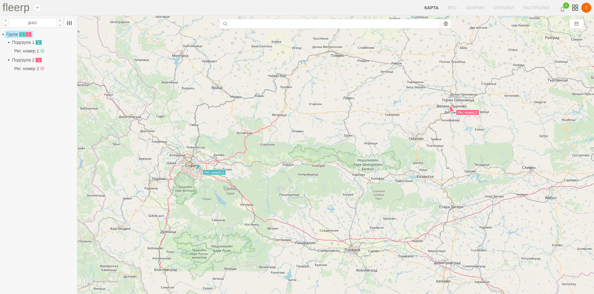

# Селектиране на обекти

Предоставената дървовидна структура в панела дава възможност за избор на визуализация за:
 - всички налични проследяващи обекти; 
 - само за проследяващи обекти от дадена група;

При селектиране на група от дървото, върху картата се визуализират само тези обекти, които са част от нея.

Ако потребителят избере най-главната група, тогава върху картата ще се появят всички налични обекти, намиращи се във всички групи.

При избор на дадена подгрупа, върху картата ще се появят само принадлежащите към нея обекти.

При деселектиране на дадена група, върху картата се изобразяват всички налични проследяващи обекти.

Визуализацията на маршрут при избор на даден обект от някоя група, по подразбиране е на дневна база.

При необходимост периодът може да бъде променян от потребителя спрямо неговите нужди от предоставения за целта бутон.

Предоставена е възможност за допълнителни настройки, свързани с визуализацията на обекти върху картата.

