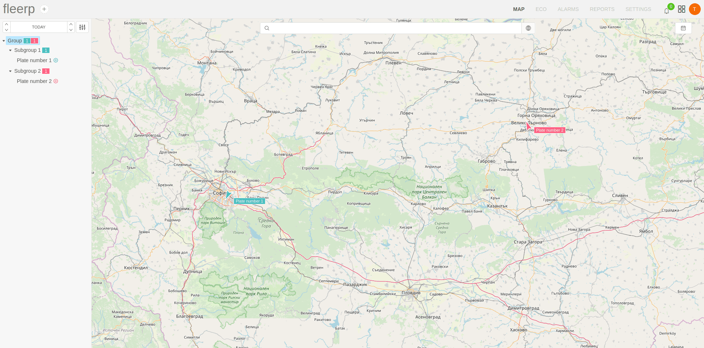
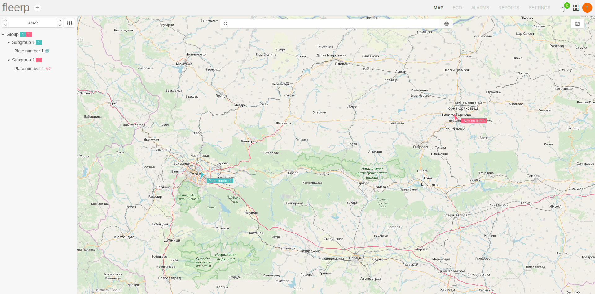
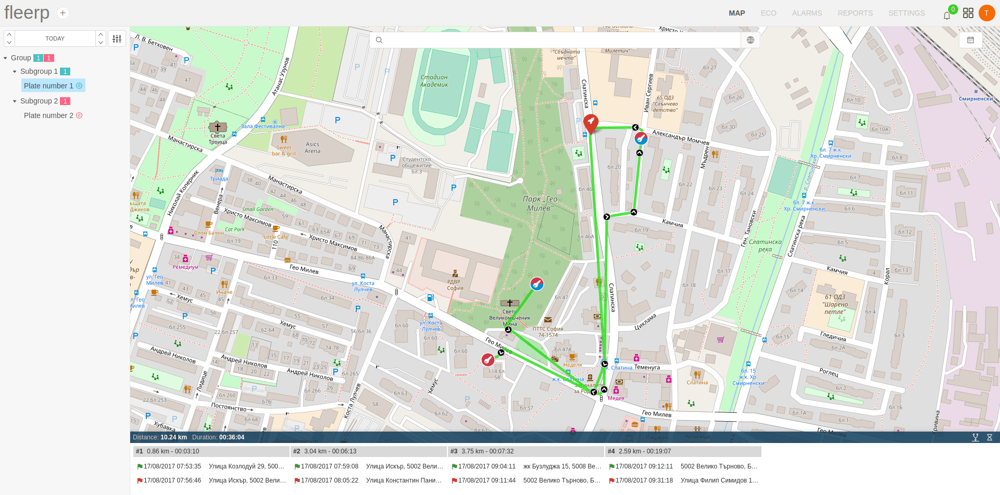
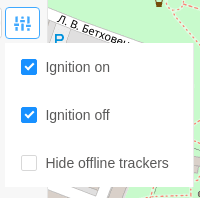

# Object selection

The provided tree structure in the panel allows you to select a visualization for:
 - all available tracking objects; 
 - only for tracking objects which belong to given group;

When selecting a tree group, only those objects that are part of it are displayed on the map.

If the user chooses the most top level group, then all available objects located in all groups will appear on the map.

When selecting a subgroup, only the objects belonging to it will appear on the map.

When a group is deselected, all available tracking objects are displayed on the map.

Visualization of route when selecting an object from a group, by default, is on a daily basis.

If necessary, the period can be changed by the user according to his needs from the provided button.

Additional settings related to object visualization on the map are provided.

