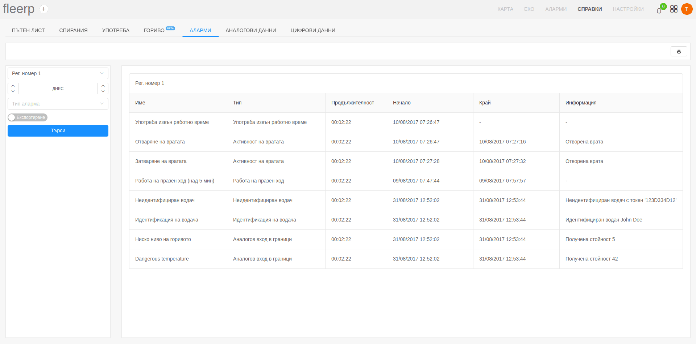
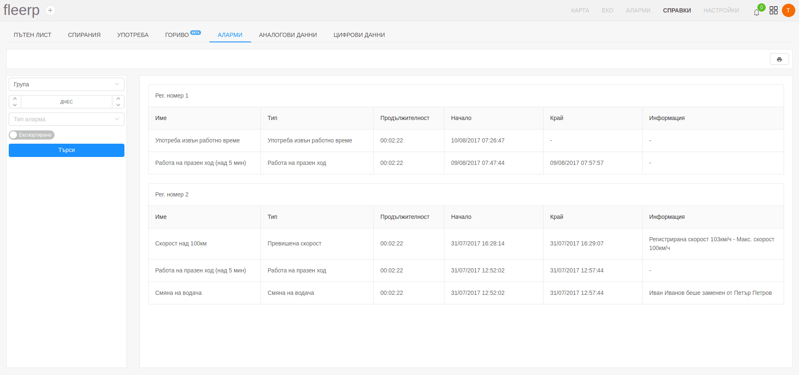

# Аларми

Справката за аларми предоставя информация за всички възникнали аларми за даден проследяващ обект или група от обекти, в
рамките на даден период.

Предоставената справка визуализира следната информация:
- име на алармата;
- тип на алармата;
- продължителност на алармата;
- начало на алармата;
- край на алармата;
- допълнителна информация;

Ако потребителят посочи тип на аларма, при търсенето ще се визуализират само алармите от зададения тип. В противен случай
ще бъдат визуализирани всички възникнали аларми.
