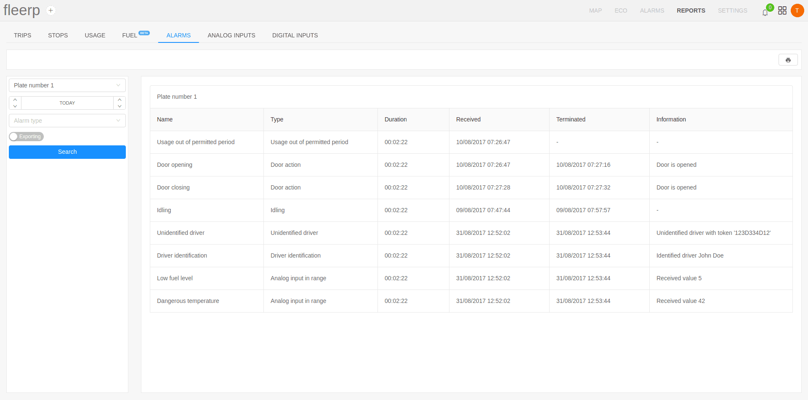

# Alarms

The Alarms report provides information about all alarms that occurred for a tracking object or group of objects within a given period.

The report provides the following information:
- alarm name;
- alarm type
- alarm duration;
- alarm received;
- alarm terminated;
- additional information;

If the user specifies an alarm type, only the alarms of the specified type will be displayed in the search. Otherwise, all alarms will be displayed.
