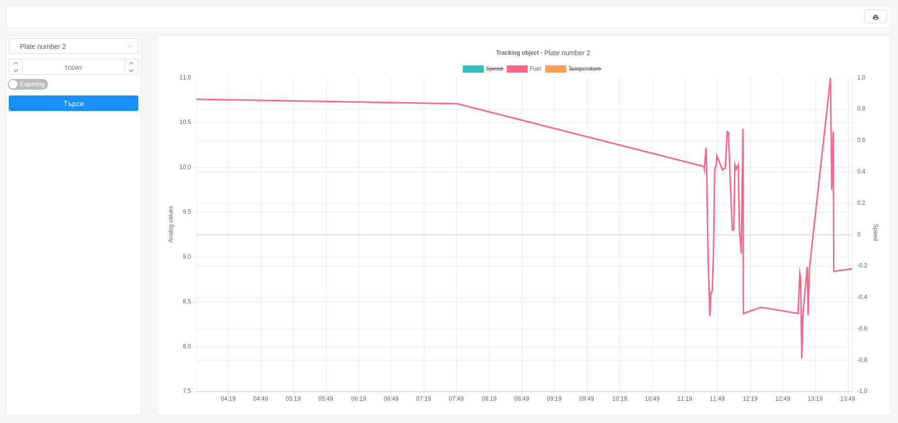
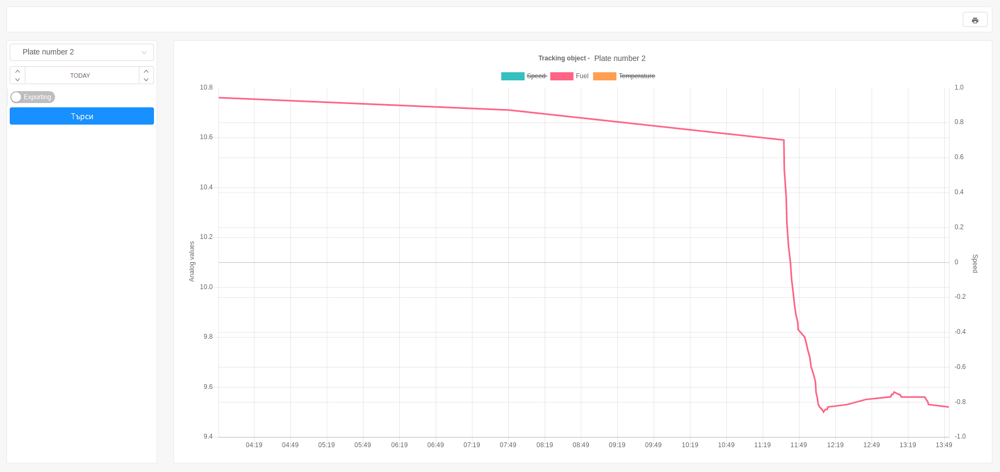

# Analog inputs

Analog inputs provides visual information about the status of analog ports through line charts.
Analog inputs report is generated for a particular tracking object.
This example visualizes the speed, temperature and fuel data of a concrete tracking object.

Generating analog inputs report is done by the selection of:

- tracking object; 
- time frame;  

The report contains data about the analog ports that are configured for the given object.
For this example, the following analog ports are chosen:

- **Speed** - graphical representation of speed changes;
- **Fuel** - graphical representation for the presence of fuel;
- **Temperature** - graphical representation the outside temperature;

For more detailed information, dragging the mouse on the line chart displays
the data from the analog ports at any point in the report.

The visualization of data from different analog ports can be hidden and displayed with click on a label.

---

### Important:

There are possible noises in the analog data that are received by the tracking object.
This problem is easily solved when configuring a port. In the settings of each port there is a "Noises" button 
and when it is activated the line chart smooths *[link](../../../web/settings/tobjects/details/ports/analogs)*.

