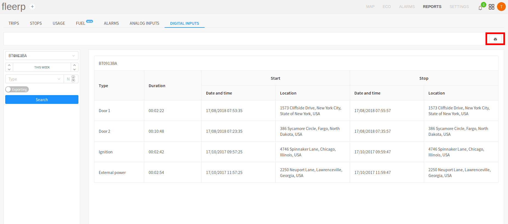

# Digital inputs

The digital inputs provides the user with possibility to generate detailed report concerning the already
configured digital ports on a given tracking object or group of tracking objects.

 
---

The screen is divided in two components:

- side-panel;
- main screen;

### Side-panel

 
---

The side-panel consists of:

- field for picking a tracking object or a group of tracking objects;
- field for picking a time frame, for which the report to be generated;
- field for picking port type, for which the report to be generated;
- button for exporting the report in an Excel file;

#### Important:

If the type select field is left empty, a report for all configured digital ports for the given device
will be generated.

The type select field provides functionality for port type indexing. This allows generating reports for
repetitive port types, such as: door-1, door-2 etc...

### Main screen

 
---

The main screen consists of several fields:

- **type** - the type of the port;
- **duration** - the total time the port was active;
- **start** - date and time, as well as location (address) of the port activation;
- **end** - date and time, as well as location (address) of the port deactivation;

There is the option for printing the generated report by the provided button:

