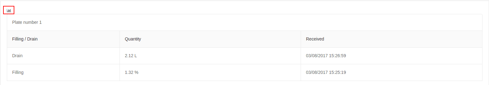

# Fuel

The fuel report provides information on the availability of fuel for a tracking object and is available only when fuel sensor is installed.

By identifying sudden changes in fuel level, it could be claimed that one of the performed activities is:
- fuel draining;
- refueling;

The report contains the following information:
- description of the taken action - filling or drain;
- measured fuel quantity;
- the time when the action was taken;

The fuel report can be generated for both a single object and an entire group.

Additional information is added as a line chart available from the added button.

It is possible visualized data to be hidden/shown after click on given label.

 

When the mouse is moved to a point on the line chart, a window with information for given time is displayed.

**Important:** the functionality is in beta development stage and incorrect data may occur due to values incorrectly read by the sensor.
