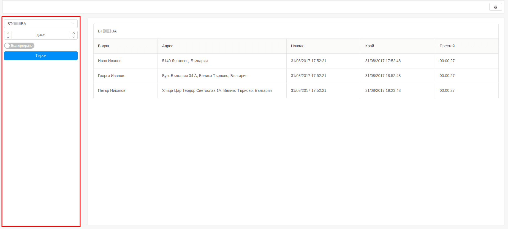
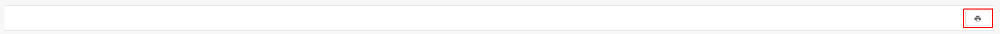
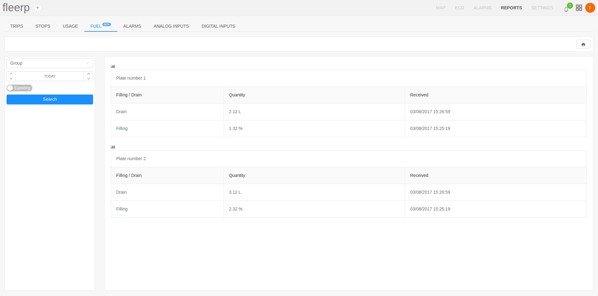
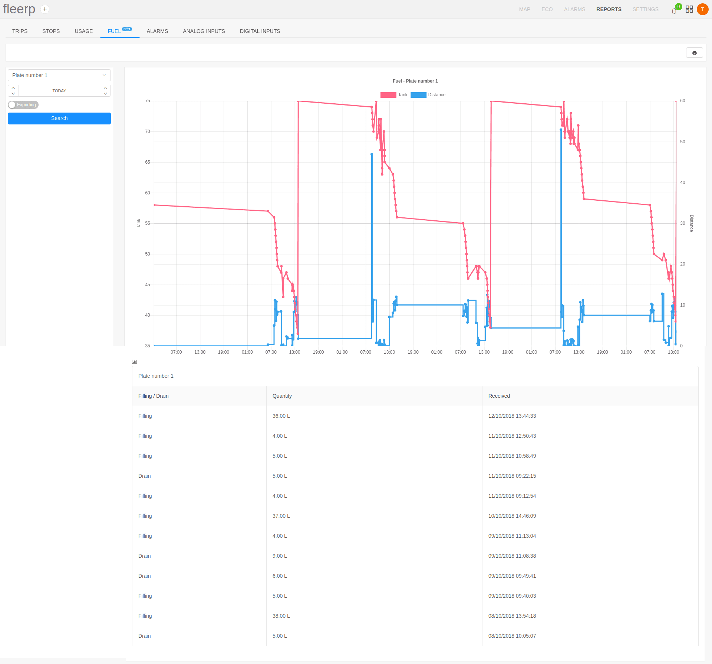
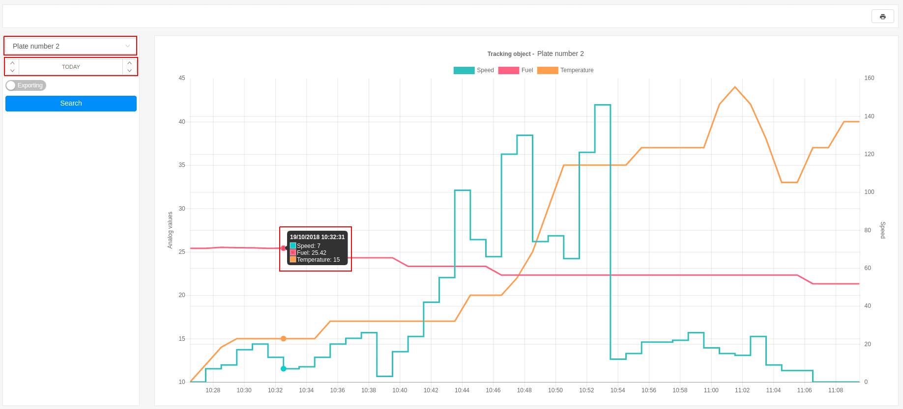

# Reports

Better work and reduced costs are one of the important goals of growing organizations.
Reports are one of the most important tools for achieving these goals.
The following types of reports are integrated into the Fleerp system.

- Trips;
- Stops;
- Usage;
- Fuel;
- Alarms;
- Analog inputs;
- Digital inputs;

The main screen is divided in two main components:

- sidebar;
- main screen;

## Sidebar

The sidebar serves the following purposes:

- set period of time, for which report to be generated;
- filtering and selection of a concrete tracking object or group;
- exporting - the generated report is exported to an Excel file; 

---

## Main screen

The main screen displays data that is collected from the tracking objects for the selected time frame.

---

The user is able to print given report via the provided button.

# Trips

Report trips provides detailed information on the movement of the tracking objects.
There are two types of trip reports:

- simplified trip report;
- detailed trip report;

## Simplified trip report

Generating simplified report is done by the selection of:

- tracking object or group; 
- time frame; 

The report contains the following information:

- **date** - the date of the report;
- **drive duration** - the total time that the tracking object was in movement; 
- **stop duration** - the total time that the tracking object was stationary;
- **distance** - distance travelled;
- **mileage** 
  - **start** - the odometer reading at the start of the report;
  - **end** - the odometer reading at the end of the report;
  

---

## Detailed trip report

The detailed trip report provide complete information on each stop and start, where and when it happened
and much more detailed and useful information.

Generating detailed report is done by the selection of:

- tracking object or group; 
- time frame;  
- click on the "Details" button; 

The report contains the following information:

- **driver** - the name of the driver;
- **start**;
  - odometer reading at the start of the trip; 
  - date and time of departure; 
  - start address;
- **driving**;
  - **duration** - the total time the tracking object was moving;
  - **distance** - the distance traveled;
- **end**;
  - odometer reading at the end of the trip;
  - date and time of the stop;
  - stop address;
- **Idle** - the elapsed time from the stop to the start of the next trip of the tracking object;

# Stops

The stops report provides detailed information on where, when, and for how long it is stopped.

Generating stops report is done by the selection of:

- tracking object or group;
- time frame;

The report contains the following information:

- **driver** - the name of the driver;
- **address** - the address of which given tracking object is staying for a period of time;
- **start** - start of the period of stay;
- **end** - end of the period of stay;
- **duration** - the time that the tracking object was stationary;

# Usage

The usage report provides detailed information about when the tracking object was on the trip.
This report generated information that depends on the company's work time
*[link](../../web/settings/general)*.

Generating usage report is done by the selection of:

- tracking object or group;
- time frame;

The report contains the following information:

- **data** - the date of the report;
- **working time**;
  - **mileage** - the distance traveled;
  - **duration** - the total time the tracking object was moving;
- **free time**;
  - **mileage** - the distance traveled;
  - **duration** - the total time the tracking object was moving;

# Fuel

The fuel report provides information on the availability of fuel for a tracking object and is available only when fuel sensor is installed.

By identifying sudden changes in fuel level, it could be claimed that one of the performed activities is:
- fuel draining;
- refueling;

The report contains the following information:
- description of the taken action - filling or drain;
- measured fuel quantity;
- the time when the action was taken;

The fuel report can be generated for both a single object and an entire group.

Additional information is added as a line chart available from the added button.

It is possible visualized data to be hidden/shown after click on given label.

 

When the mouse is moved to a point on the line chart, a window with information for given time is displayed.

**Important:** the functionality is in beta development stage and incorrect data may occur due to values incorrectly read by the sensor.

# Alarms

The Alarms report provides information about all alarms that occurred for a tracking object or group of objects within a given period.

The report provides the following information:
- alarm name;
- alarm type
- alarm duration;
- alarm received;
- alarm terminated;
- additional information;

If the user specifies an alarm type, only the alarms of the specified type will be displayed in the search. Otherwise, all alarms will be displayed.

# Analog inputs

Analog inputs provides visual information about the status of analog ports through line charts.
Analog inputs report is generated for a particular tracking object.
This example visualizes the speed, temperature and fuel data of a concrete tracking object.

Generating analog inputs report is done by the selection of:

- tracking object; 
- time frame;  

The report contains data about the analog ports that are configured for the given object.
For this example, the following analog ports are chosen:

- **Speed** - graphical representation of speed changes;
- **Fuel** - graphical representation for the presence of fuel;
- **Temperature** - graphical representation the outside temperature;

For more detailed information, dragging the mouse on the line chart displays
the data from the analog ports at any point in the report.

The visualization of data from different analog ports can be hidden and displayed with click on a label.

---

### Important:

There are possible noises in the analog data that are received by the tracking object.
This problem is easily solved when configuring a port. In the settings of each port there is a "Noises" button 
and when it is activated the line chart smooths *[link](../../web/settings/tobjects/details/ports/analogs)*.

# Digital inputs

The digital inputs provides the user with possibility to generate detailed report concerning the already
configured digital ports on a given tracking object or group of tracking objects.

---

The screen is divided in two components:

- side-panel;
- main screen;

## Side-panel

---

The side-panel consists of:

- field for picking a tracking object or a group of tracking objects;
- field for picking a time frame, for which the report to be generated;
- field for picking port type, for which the report to be generated;
- button for exporting the report in an Excel file;

#### Important:

If the type select field is left empty, a report for all configured digital ports for the given device
will be generated.

The type select field provides functionality for port type indexing. This allows generating reports for
repetitive port types, such as: door-1, door-2 etc...

## Main screen

---

The main screen consists of several fields:

- **type** - the type of the port;
- **duration** - the total time the port was active;
- **start** - date and time, as well as location (address) of the port activation;
- **end** - date and time, as well as location (address) of the port deactivation;

There is the option for printing the generated report by the provided button:

