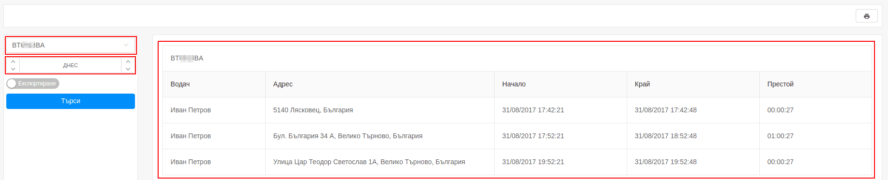

# Спирания

Справката за спирания предоставя подробна информация, за това къде, кога и за какъв период от време е спирано.

Генерирането на справката се извършва от страничния панел с избор на:

- конкретен обект или група;
- определен период от време;

Справката съдържа следната информация:

- **водач** - името на водача;
- **адрес** - адрес на престоя;
- **начало** - начало на престоя;
- **край** - край на престоя;
- **престой** - общото време в което проследявания обект е бил в покой;

