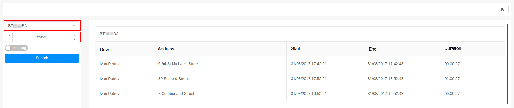

# Stops

The stops report provides detailed information on where, when, and for how long it is stopped.

Generating stops report is done by the selection of:

- tracking object or group;
- time frame;

The report contains the following information:

- **driver** - the name of the driver;
- **address** - the address of which given tracking object is staying for a period of time;
- **start** - start of the period of stay;
- **end** - end of the period of stay;
- **duration** - the time that the tracking object was stationary;

