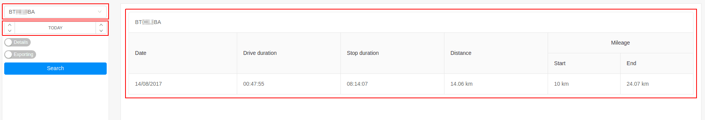
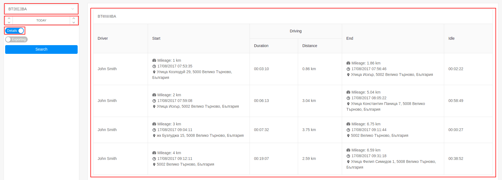

# Trips

Report trips provides detailed information on the movement of the tracking objects.
There are two types of trip reports:

- simplified trip report;
- detailed trip report;

### Simplified trip report

Generating simplified report is done by the selection of:

- tracking object or group; 
- time frame; 

The report contains the following information:

- **date** - the date of the report;
- **drive duration** - the total time that the tracking object was in movement; 
- **stop duration** - the total time that the tracking object was stationary;
- **distance** - distance travelled;
- **mileage** 
  - **start** - the odometer reading at the start of the report;
  - **end** - the odometer reading at the end of the report;
  

---

### Detailed trip report

The detailed trip report provide complete information on each stop and start, where and when it happened
and much more detailed and useful information.

Generating detailed report is done by the selection of:

- tracking object or group; 
- time frame;  
- click on the "Details" button; 

The report contains the following information:

- **driver** - the name of the driver;
- **start**;
  - odometer reading at the start of the trip; 
  - date and time of departure; 
  - start address;
- **driving**;
  - **duration** - the total time the tracking object was moving;
  - **distance** - the distance traveled;
- **end**;
  - odometer reading at the end of the trip;
  - date and time of the stop;
  - stop address;
- **Idle** - the elapsed time from the stop to the start of the next trip of the tracking object;

