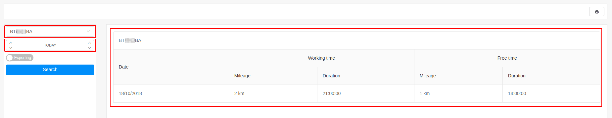

# Usage

The usage report provides detailed information about when the tracking object was on the trip.
This report generated information that depends on the company's work time
*[link](../../../web/settings/general)*.

Generating usage report is done by the selection of:

- tracking object or group;
- time frame;

The report contains the following information:

- **data** - the date of the report;
- **working time**;
  - **mileage** - the distance traveled;
  - **duration** - the total time the tracking object was moving;
- **free time**;
  - **mileage** - the distance traveled;
  - **duration** - the total time the tracking object was moving;

