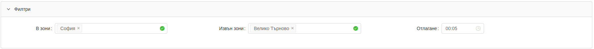
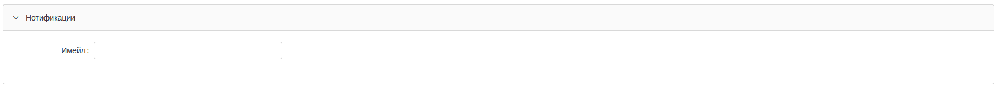
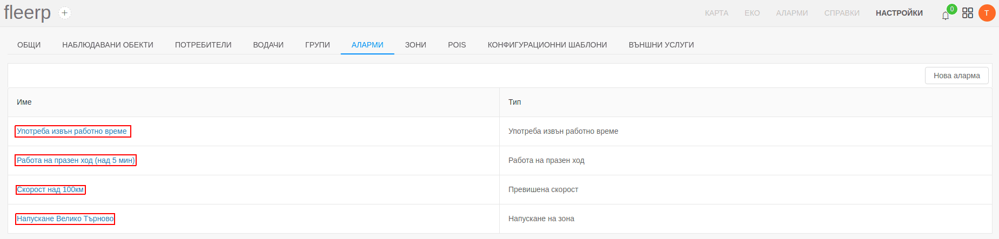
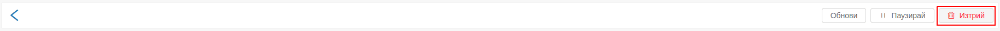

# Аларми

При наличието на много на брой проследявани обекти, потребителят ще е затруднен да наблюдава всеки един от тях.
За това алармите са един от най-важните инструменти, с които потребителят може лесно да контролира всички
проследявани обекти. Това е възможно чрез създаване на аларми, които ще дават синтезирана информация, какви нарушения са 
извършени. 

Основни функции:
- създаване на нова аларма;
- редактиране на аларма; 
- паузиране на аларма;
- изтриване на аларма;

# Нова аларма

Създаването на нова аларма се извършва чрез бутон "Нова аларма"

При създаване на нова аларма са необходими следните настройки:

## Основни

- Тип - избира се типа на алармата;
- Име - въвежда се произволно име на алармата;
- Обекти - избират се обекти и/или групи за които да се задейства съотвтната аларма;

---

## Правила

Полето *Правила* е достъпно за конфигуриране само за някои аларми. 

---

## Филтри

- В зона - при селектиране на зона, алармата ще се задейства само ако обектът е в границите на зоната.
- Извън зона - при селектиране на зона, алармата ще се задейства само ако обектът е извън границите на зоната.
- Отлагане - алармата ще се задейства само ако тя е по-продължителна от времето за отлагане. 

---

## Нотификации

Полето за нотификации дава възможност на потребителя да предостави имейл адрес, на който да се изпращат
задействаните аларми.

# Редактиране на аларма

Редактирането на аларма се извършва чрез кликване върху дадена аларма.

---

Конфугурираните данни за дадената аларма се зареждат в нов прозорец.
Всяко едно поле с данни може да бъде променено, дори ако то не е било конфигурирано предварително.
Промените се запазват с бутон "Обнови".

ане на аларма 

Всяка аларма може да бъде паузирана за определен период от време.

## Избира се желаната аларма

---

## Паузиране

Паузирането на алармата е необходимо, когато трябва да се игнорира дадена аларма за определен период от време.
В това си състояние алармата няма да се задейства. 

---

## Възстановяване

Паузираната аларма може да се възстанови отново. Активирането й отново става с бутона "Възстанови". 

# Изтриване на аларма

Лесно може да се изтрие вече създадена аларма: 

## Избира се желаната аларма

---

## Кликва се бутон "Изтрий"

