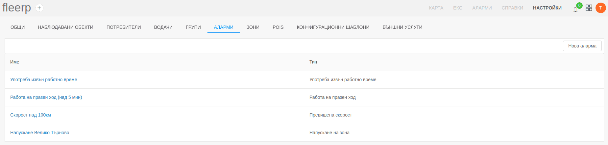

# Аларми

При наличието на много на брой проследявани обекти, потребителят ще е затруднен да наблюдава всеки един от тях.
За това алармите са един от най-важните инструменти, с които потребителят може лесно да контролира всички
проследявани обекти. Това е възможно чрез създаване на аларми, които ще дават синтезирана информация, какви нарушения са 
извършени. 

Основни функции:
- създаване на нова аларма;
- редактиране на аларма; 
- паузиране на аларма;
- изтриване на аларма;

