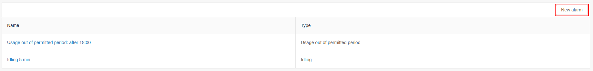
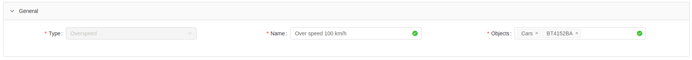
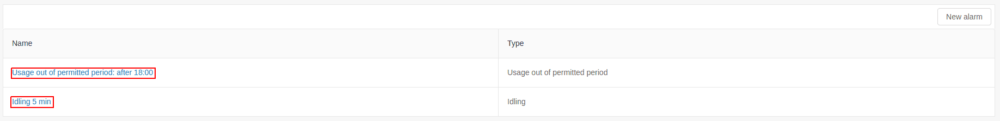
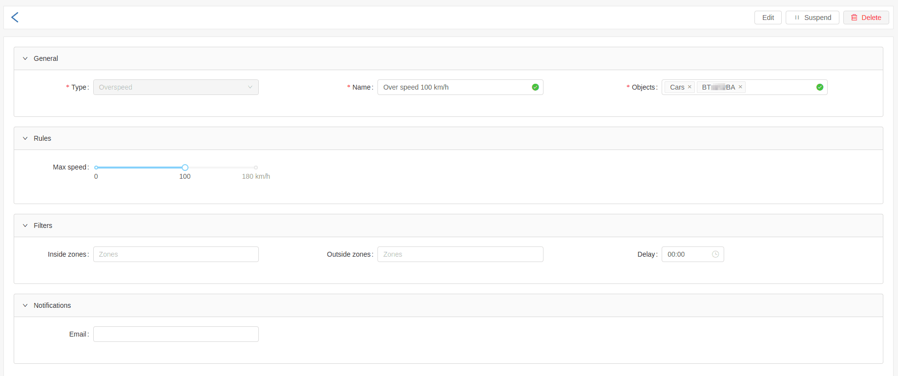
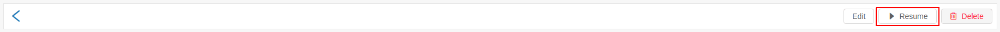

# Alarms

Having multiple tracking objects available, the user will have difficulty monitoring each of them.
The alarms are one of the most important tools with which the user can easily control all tracking objects
by creating alarms that give synthesized information about that, what violations are done.

Basic functions:

- create a new alarm;
- edit alarm;
- suspend alarm;
- delete alarm;

# New alarm

Creating a new alarm is done with the "New Alarm" button.

For creating a new alarm, the following settings are required:

## General

- Type - the type of alarm is selected;
- Name - random name of the alarm;
- Objects - select objects and / or groups to trigger an alarm;

---

## Rules

The *Rules* field is available for configuration only for some alarms.

---

## Filters

- Inside zones - when selecting a zone, the alarm will only be triggered if the object is inside the zone;
- Outside zones - when selecting a zone, the alarm will only be triggered if the object is outside the zone;
- Delay - the alarm will only be triggered if it is longer than the delay time;

---

## Notifications

The Notification field allows the user to provide an email address, to which triggered alarms are sent.

# Edit alarm

The alarm can be edited by clicking on the link.

---

The alarm data is loaded into a new section. All fields can be changed, also those that are empty.
Changes are saved with the "Edit" button.

# Suspend alarm

Any alarm can be paused for a certain period of time.

## Select the desired alarm

---

## Suspend

Suspending the alarm is necessary when ignoring an alarm for an indefinite period of time.
In this state, the alarm will not be triggered.

---

## Resume

Suspended alarm can be restored. Activation is done with the "Resume" button.

# Delete alarm

It is easy to delete an alarm already created:

## Select the desired alarm

## Click "Delete" button

