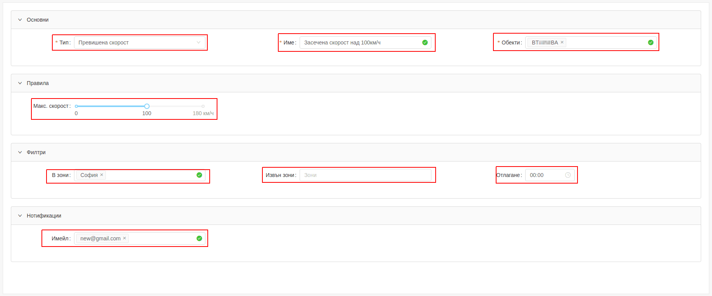

# Редактиране на аларма

Редактирането на аларма се извършва чрез кликване върху дадена аларма.

---

Конфугурираните данни за дадената аларма се зареждат в нов прозорец.
Всяко едно поле с данни може да бъде променено, дори ако то не е било конфигурирано предварително.
Промените се запазват с бутон "Обнови".

