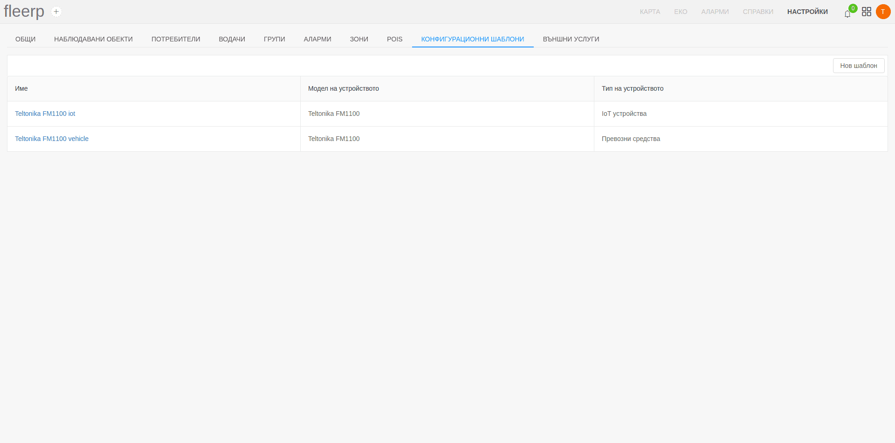
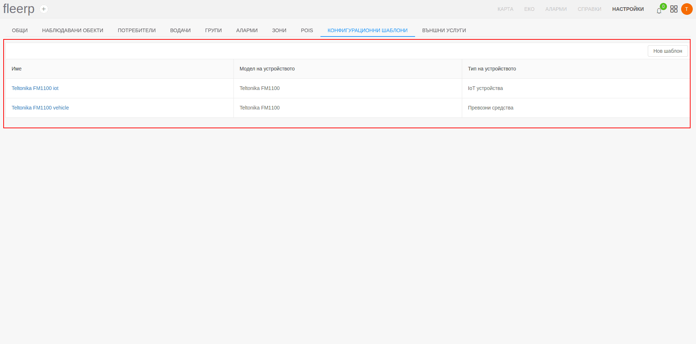
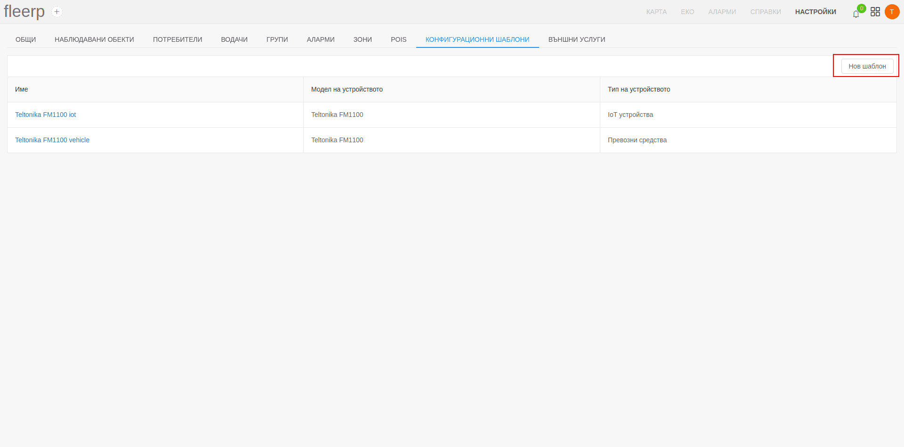
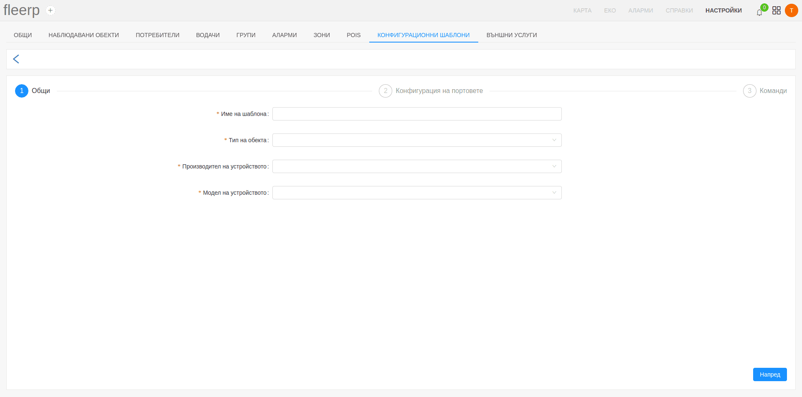
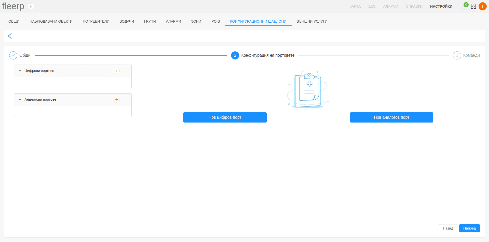
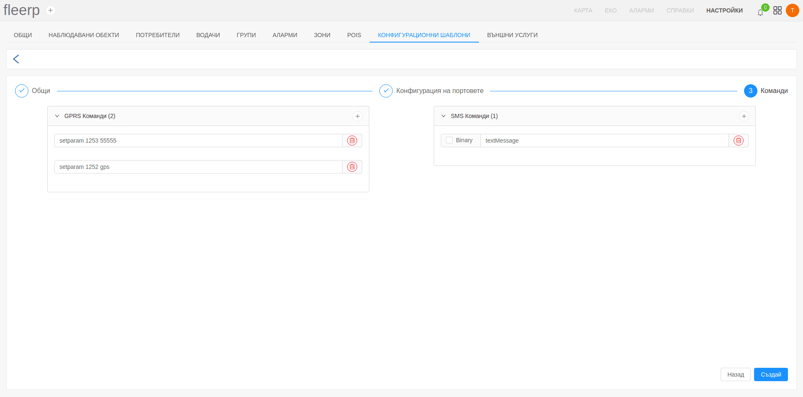
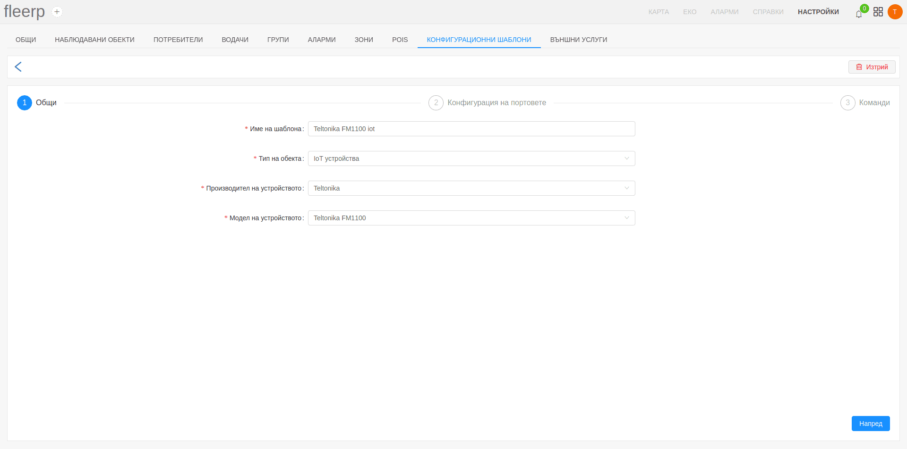

# Конфигурационни шаблони

Системата Fleerp предоставя лесен и удобен начин за автоматично конфигуриране на нови проследяващи обекти.
Даден проследяващ обект може да влезе в експлоатация, само след като е преминал през етапа на конфигурация.
Тогава той е готов за работа и може да изпраща необходимите данни за обработка от системите.
Самата конфигурация се извършва посредством конфигурационни шаблони, дефинирани от потребителя и отговарящи на конкретните му нужди за обекта.

Веднъж след като е създаден, даден шаблон може да бъде прилаган многократно към различни проследяващи обекти от дадения тип и модел.
Информацията тип, производител и модел се предоставя от потребителя по време на процеса на активация - *[линк](../../../docs/get-started/tracker-activation/tracking-devices)*.
Ако за даденият модел има създаден шаблон, тогава обекта ще бъде конфигуриран спрямо него. В противен случай потребителят
трябва да извърши активацията ръчно чрез изпращане на необходимите команди.

За визуализация на всички съществуващи шаблони, както и за създаване на нови е налична секция "Конфигурационни шаблони" в лентата с настройки.

# Списък с конфигурационни шаблони

При избор на секция "Конфигурационни шаблони" в лентата с настройки, е налична визуализация на всички съществуващи шаблони, създадени от потребителя.

# Създаване на нов конфигурационен шаблон

За да създаде нов конфигурационен шаблон потребителят трябва да кликне върху бутона "Нов шаблон".

Конфигурационният шаблон се състои от три секции: 

- общи настройки;

- конфигурация на портовете;

Попълването на информация в тази секция е аналогично на секция "Портове" в настройките на наблюдаван обект - *[линк](../../settings/tobjects/details/ports)*.

- команди за настройка на проследяващ обект - могат да бъдат изпратени под формата на GPRS команди или текстови/бинарни SMS команди;

# Редактиране на конфигурационен шаблон

Налична е възможност за редакция на съществуващ конфигурационен шаблон.
След клик върху дадено име на шаблон от списъка, потребителят ще бъде отведен към екран за редакция.

# Изтриване на конфигурационен шаблон

Налична е възможност за изтриване на даден конфигурационен шаблон, чрез предоставения бутон в менюто за редакция.

