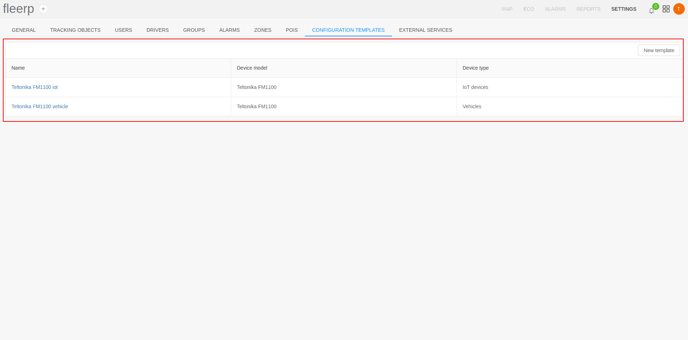
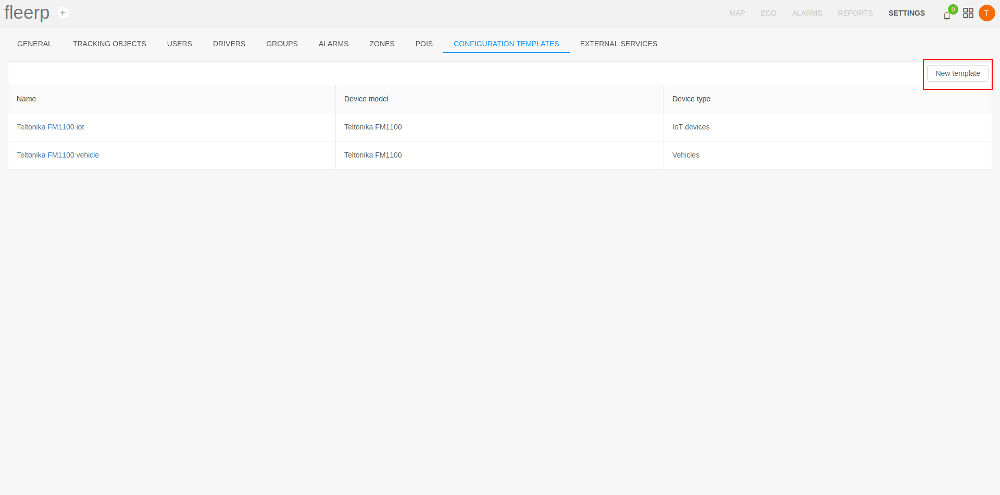
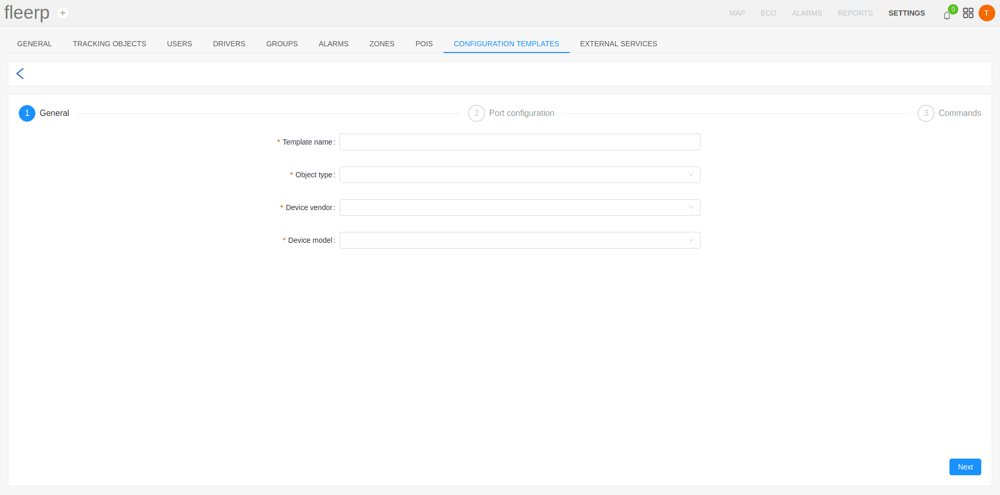
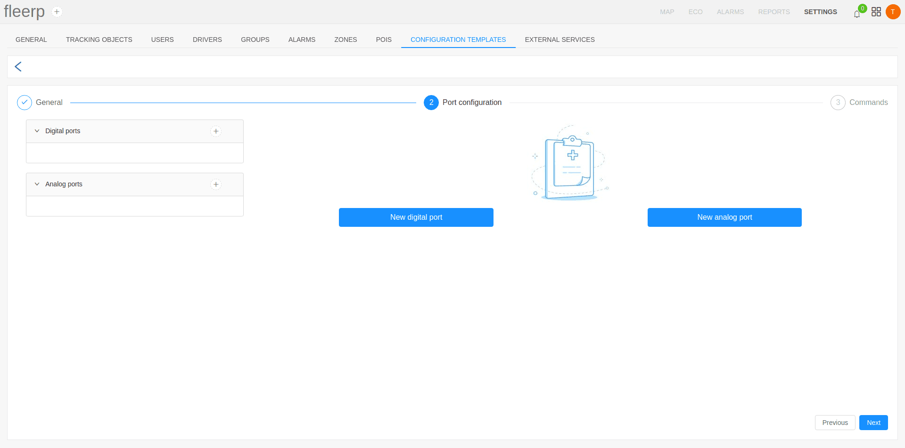
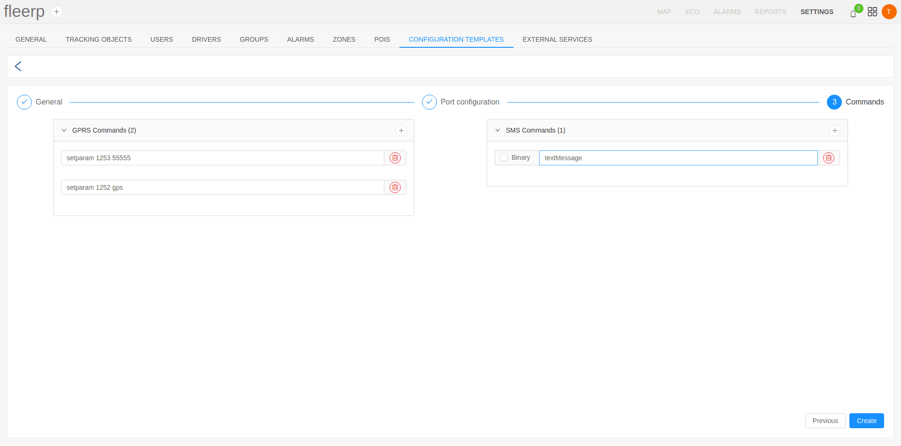
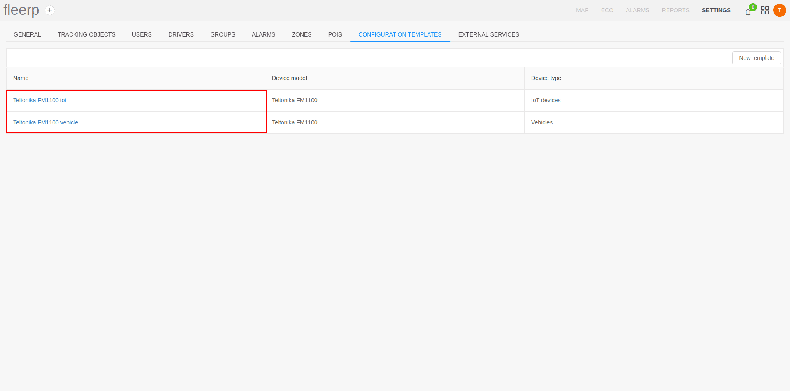
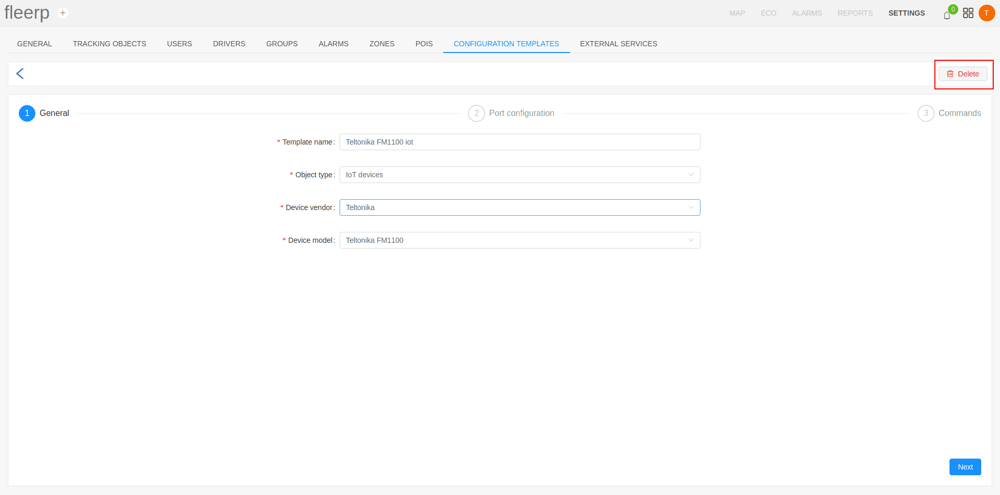

# Configuration templates

The system Fleerp provides an easy and convenient way to automatically configure new tracking objects.
A tracking object may only enter into service after it has passed the configuration stage.
Then it is ready for work and can send the necessary data for processing by the systems.
The configuration of a tracking object itself is performed using configuration templates, defined by the user and meeting some specific needs for the tracking object.

Once it is created, a template can be applied multiple times to different tracking objects from the specified type and model.
The type, manufacturer and model information is provided by the user during the activation process.
If a template is created for a given model, then the tracking object will be configured according template.
Otherwise, the user must perform the activation manually by sending the necessary commands.

To preview all existing templates as well as create new ones, a "Configuration templates" section is available in the settings bar.

# List with configuration templates

When selecting the "Configuration templates" section in the settings bar, a visualization of all existing templates, created by the user is available.

# Create new configuration template

To create a new configuration template, the user must click the "New template" button.

The configuration template consists of three sections:

- general;

- port configuration;

Filling information in this section is similar to the "Ports" section in the tracking object settings - *[link](../../settings/tobjects/details/ports)*.

- tracking object setup commands - can be sent as GPRS commands or text/binary SMS commands;

# Edit a configuration template

There is an option to edit an existing configuration template.
After clicking on a given template name from the list, the user will be redirected to the edit screen.

# Delete a configuration template

There is an option to delete a configuration template by using the button provided in the edit menu.

