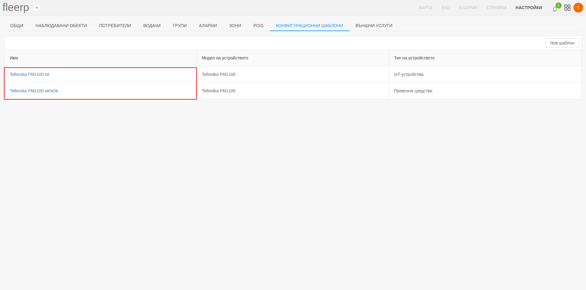

# Редактиране на конфигурационен шаблон

Налична е възможност за редакция на съществуващ конфигурационен шаблон.
След клик върху дадено име на шаблон от списъка, потребителят ще бъде отведен към екран за редакция.

